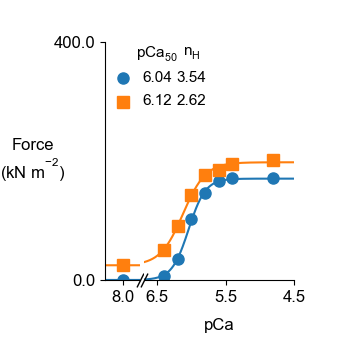

# pCa curves at two lengths

## Overview

This demo extends the [single curve demo](../single_curve/single_curve.html) and shows how to use a batch structure to calculate tension-pCa curves for a half-sarcomere held at 2 different lengths.

## What this demo does

This demo:

+ Runs a series of simulations in which a half-sarcomere is activated in solutions with pCa values ranging from 8.0 to 4.8 at a sarcomere length of 1.9 µm and again at a sarcomere length of 2.3 µm

+ Calculates the steady-state force produced at each sarcomere length and each pCa and plots the results as two tension-pCa curves

## Instructions

Before proceeding, make sure that you have followed the [installation instructions](../../installation/installation.html). You need the FiberSim repository, an Anaconda distribution of Python, and an active FiberSim environment to run this demo.

### Getting ready

+ Open an Anaconda Prompt

+ Activate the FiberSim Anaconda Environment by executing:
```
conda activate fibersim
```
+ Change directory to `<repo>/code/FiberPy/FiberPy`, where `<repo>` is the directory where you installed FiberSim

### Run a simulation

+ Type:
 ```
 python FiberPy.py run_batch "../../../demo_files/tension_pCa/two_lengths/batch_two_lengths.json"
 ```

+ You should see text appearing in the terminal window, showing that the simulations are running. When it finishes (this may take a few minutes), you should see something similar to the image below.


### Viewing the results

All of the results from the simulation are written to files in `<repo>/demo_files/tension_pCa/two_lengths/sim_output`

+ The file `force_pCa_curve.png` in the main `sim_output` folder shows the steady-state force values and Hill curves fitted to the data at each length.



+ Simulations for each pCa value are stored in the sub-folders named `1` and `2`. The first folder contains all the simulations for a sarcomere length of 1.9 µm. The second folder contains the simulations for 2.3 µm.


Within each sub-folder, for each pCa value, there is:

+ a `*.txt` file with the main simulation results
+ a `*.png` file with a summary figure


## How this worked

The tension-pCa curve was calculated by running a sequence of simulations, each of which corresponded to a half-sarcomere activated in a different pCa solution at a given half-sarcomere length.

Each simulation was defined by a job, with the different jobs being grouped together as an array. All of this information is stored in the `batch_two_lengths.json` file that was passed to FiberPy and which is displayed below.

Looking at the first job, you can see that FiberSim will run a simulation using:
+ `model_file: sim_input/1/model_1.json`
+ `options_file: sim_input/sim_options.json`
+ `protocol_file: sim_input/1/pCa_800/prot_pCa_800.txt`

with the results being written to `sim_output/1/pCa_800_results.txt` and summary figures being created based on `sim_input/1/pCa_800/output_handler_800.json`

The other jobs in the array use a similar structure.

Note that the first half of the simulations use the model specified by the `sim_input/1/model_1.json` file while the second half uses the model specified by the `sim_input/2/model_2.json` file. These files set the half-sarcomere length to 950 nm and 1150 nm respectively, corresponding to sarcomere-lengths of 1.9 and 2.3 µm.

The final section of the batch file, labeled `batch_figures`, tells FiberPy to collate the results in the `sim_output` folder, plot a tension-pCa curve, and save the image to a specified file-name. The code underlying this part of the process assumes that all of the `*.txt` files in `sim_output/1` are the results files for the first curve while the `*.txt` files in `sim_output/2` correspond to the second curve. 

````
{
   "FiberSim_batch":
   {
        "FiberCpp_exe":
        {
            "relative_to": "this_file",
            "exe_file": "../../../bin/fibercpp.exe"
        },
        "job": [
            {
                "relative_to": "this_file",
                "model_file": "sim_input\\1\\model_1.json",
                "options_file": "sim_input/sim_options.json",
                "protocol_file": "sim_input\\1\\pCa_800\\prot_pCa_800.txt",
                "results_file": "sim_output\\1\\pCa_800_results.txt",
                "output_handler_file": "sim_input\\1\\pCa_800\\output_handler_800.json"
            },
            {
                "relative_to": "this_file",
                "model_file": "sim_input\\1\\model_1.json",
                "options_file": "sim_input/sim_options.json",
                "protocol_file": "sim_input\\1\\pCa_640\\prot_pCa_640.txt",
                "results_file": "sim_output\\1\\pCa_640_results.txt",
                "output_handler_file": "sim_input\\1\\pCa_640\\output_handler_640.json"
            },
            {
                "relative_to": "this_file",
                "model_file": "sim_input\\1\\model_1.json",
                "options_file": "sim_input/sim_options.json",
                "protocol_file": "sim_input\\1\\pCa_620\\prot_pCa_620.txt",
                "results_file": "sim_output\\1\\pCa_620_results.txt",
                "output_handler_file": "sim_input\\1\\pCa_620\\output_handler_620.json"
            },
            {
                "relative_to": "this_file",
                "model_file": "sim_input\\1\\model_1.json",
                "options_file": "sim_input/sim_options.json",
                "protocol_file": "sim_input\\1\\pCa_600\\prot_pCa_600.txt",
                "results_file": "sim_output\\1\\pCa_600_results.txt",
                "output_handler_file": "sim_input\\1\\pCa_600\\output_handler_600.json"
            },
            {
                "relative_to": "this_file",
                "model_file": "sim_input\\1\\model_1.json",
                "options_file": "sim_input/sim_options.json",
                "protocol_file": "sim_input\\1\\pCa_580\\prot_pCa_580.txt",
                "results_file": "sim_output\\1\\pCa_580_results.txt",
                "output_handler_file": "sim_input\\1\\pCa_580\\output_handler_580.json"
            },
            {
                "relative_to": "this_file",
                "model_file": "sim_input\\1\\model_1.json",
                "options_file": "sim_input/sim_options.json",
                "protocol_file": "sim_input\\1\\pCa_560\\prot_pCa_560.txt",
                "results_file": "sim_output\\1\\pCa_560_results.txt",
                "output_handler_file": "sim_input\\1\\pCa_560\\output_handler_560.json"
            },
            {
                "relative_to": "this_file",
                "model_file": "sim_input\\1\\model_1.json",
                "options_file": "sim_input/sim_options.json",
                "protocol_file": "sim_input\\1\\pCa_540\\prot_pCa_540.txt",
                "results_file": "sim_output\\1\\pCa_540_results.txt",
                "output_handler_file": "sim_input\\1\\pCa_540\\output_handler_540.json"
            },
            {
                "relative_to": "this_file",
                "model_file": "sim_input\\1\\model_1.json",
                "options_file": "sim_input/sim_options.json",
                "protocol_file": "sim_input\\1\\pCa_480\\prot_pCa_480.txt",
                "results_file": "sim_output\\1\\pCa_480_results.txt",
                "output_handler_file": "sim_input\\1\\pCa_480\\output_handler_480.json"
            },
            {
                "relative_to": "this_file",
                "model_file": "sim_input\\2\\model_2.json",
                "options_file": "sim_input/sim_options.json",
                "protocol_file": "sim_input\\2\\pCa_800\\prot_pCa_800.txt",
                "results_file": "sim_output\\2\\pCa_800_results.txt",
                "output_handler_file": "sim_input\\2\\pCa_800\\output_handler_800.json"
            },
            {
                "relative_to": "this_file",
                "model_file": "sim_input\\2\\model_2.json",
                "options_file": "sim_input/sim_options.json",
                "protocol_file": "sim_input\\2\\pCa_640\\prot_pCa_640.txt",
                "results_file": "sim_output\\2\\pCa_640_results.txt",
                "output_handler_file": "sim_input\\2\\pCa_640\\output_handler_640.json"
            },
            {
                "relative_to": "this_file",
                "model_file": "sim_input\\2\\model_2.json",
                "options_file": "sim_input/sim_options.json",
                "protocol_file": "sim_input\\2\\pCa_620\\prot_pCa_620.txt",
                "results_file": "sim_output\\2\\pCa_620_results.txt",
                "output_handler_file": "sim_input\\2\\pCa_620\\output_handler_620.json"
            },
            {
                "relative_to": "this_file",
                "model_file": "sim_input\\2\\model_2.json",
                "options_file": "sim_input/sim_options.json",
                "protocol_file": "sim_input\\2\\pCa_600\\prot_pCa_600.txt",
                "results_file": "sim_output\\2\\pCa_600_results.txt",
                "output_handler_file": "sim_input\\2\\pCa_600\\output_handler_600.json"
            },
            {
                "relative_to": "this_file",
                "model_file": "sim_input\\2\\model_2.json",
                "options_file": "sim_input/sim_options.json",
                "protocol_file": "sim_input\\2\\pCa_580\\prot_pCa_580.txt",
                "results_file": "sim_output\\2\\pCa_580_results.txt",
                "output_handler_file": "sim_input\\2\\pCa_580\\output_handler_580.json"
            },
            {
                "relative_to": "this_file",
                "model_file": "sim_input\\2\\model_2.json",
                "options_file": "sim_input/sim_options.json",
                "protocol_file": "sim_input\\2\\pCa_560\\prot_pCa_560.txt",
                "results_file": "sim_output\\2\\pCa_560_results.txt",
                "output_handler_file": "sim_input\\2\\pCa_560\\output_handler_560.json"
            },
            {
                "relative_to": "this_file",
                "model_file": "sim_input\\2\\model_2.json",
                "options_file": "sim_input/sim_options.json",
                "protocol_file": "sim_input\\2\\pCa_540\\prot_pCa_540.txt",
                "results_file": "sim_output\\2\\pCa_540_results.txt",
                "output_handler_file": "sim_input\\2\\pCa_540\\output_handler_540.json"
            },
            {
                "relative_to": "this_file",
                "model_file": "sim_input\\2\\model_2.json",
                "options_file": "sim_input/sim_options.json",
                "protocol_file": "sim_input\\2\\pCa_480\\prot_pCa_480.txt",
                "results_file": "sim_output\\2\\pCa_480_results.txt",
                "output_handler_file": "sim_input\\2\\pCa_480\\output_handler_480.json"
            }
        ],
        "batch_figures":
        {
            "pCa_curves":
            [
                {
                    "relative_to": "this_file",
                    "results_folder": "sim_output",
                    "data_field": "force",
                    "output_image_file_string": "sim_output/force_pCa_curves.png",
                    "formatting":
                    {
                        "y_scaling_factor": 0.001,
                        "y_axis_label": "Force\n(kN m$\\mathregular{^{-2}}$)"
                    }
                }
            ]
        }
    }
}
````