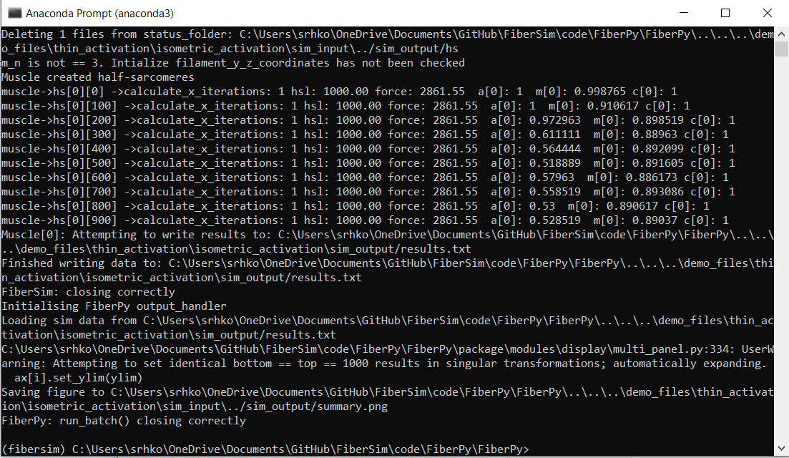
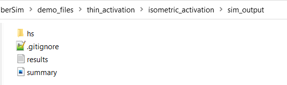
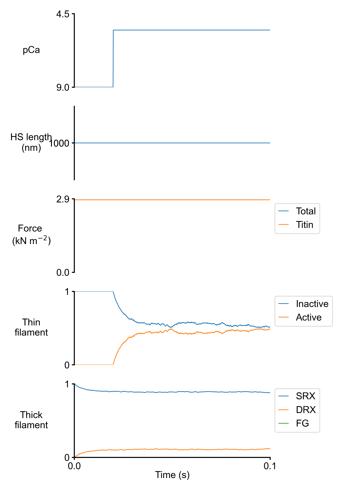
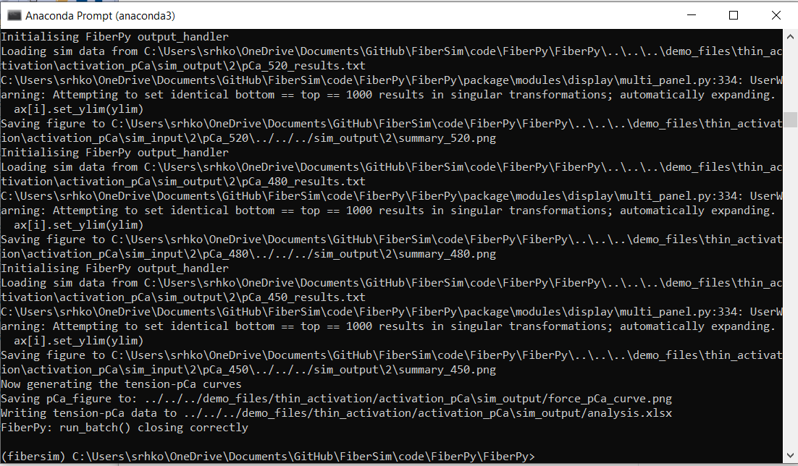
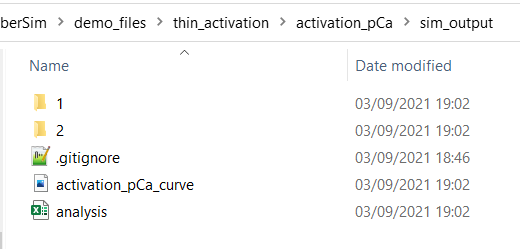
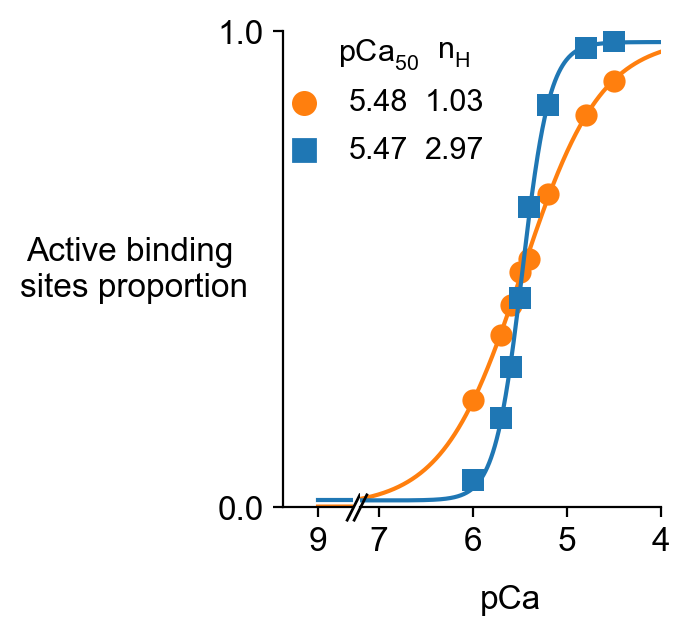
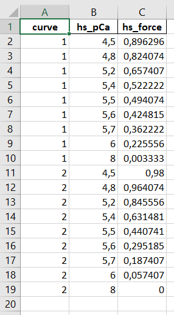
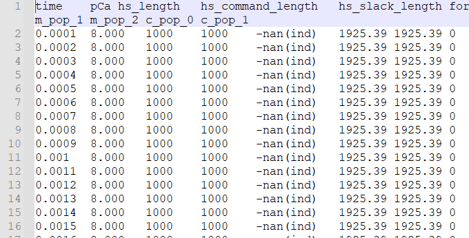
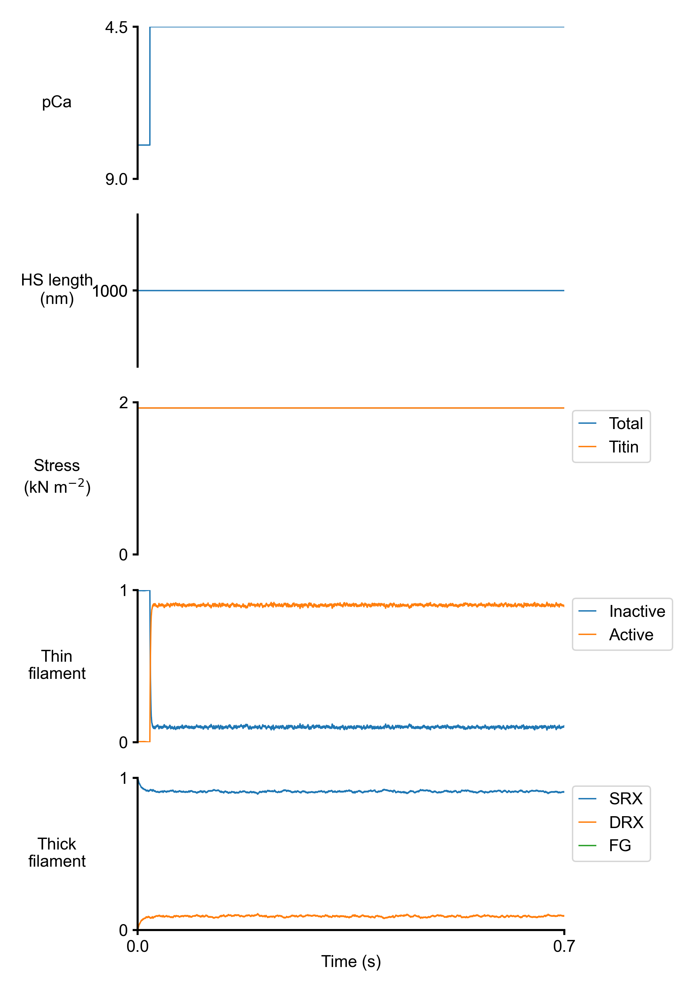

# Thin Activation demo
{:.no_toc}

## What this demo does

This demo tests different cooperative mechanisms within the thin filaments. Two examples are provided:

+ A single isometric activation protocol, where a thin filaments status file is saved for the last time-step of the simulation

+ Tension-pCa curves for two different cooperativity models

## Before getting started

1. Make sure that you have downloaded and un-zipped the FiberSim folder

2. Follow the steps provided [here](../../installation/installation.html) (starting at "Installing Anaconda")

3. Try the first demo provided [here](../getting_started/isometric_activation/isometric_activation.html)

## Isometric activation

This demo runs an isometric activation at pCa 5.5. 

### How does this work

Here is the batch file that contains the instruction for the simulationn:

````
{
    "FiberSim_batch": {
        "FiberCpp_exe":
        {
            "relative_to": "this_file",
            "exe_file": "../../../bin/FiberCpp.exe"
        },
        "job":[
            {
                "relative_to": "this_file",
                "model_file": "sim_input/model.json",
                "options_file": "sim_input/options.json",
                "protocol_file": "sim_input/pCa55_protocol.txt",
                "results_file": "sim_output/results.txt",
                "output_handler_file": "sim_input/output_handler.json"
            }
        ]
    }
}
````

This batch runs a single job (an isometric activation). The necessary input files are located in `FiberSim/demo_files/thin_activation/isometric_activation/sim_input`.

The model file contains the following important parameters:

+ `"m_n": 25`: this is the number of thick filaments (must be a square number). The number of thin filaments is double, so 50 in this simulation.
+ `"a_k_on"`, `"a_k_off"` and `"a_k_coop"` are the three parameters that allow to tune thin activation.

In the option file below, the `status_files` folder is defined, and only for the last time-step of the simulation will the status file be saved in `FiberSim/demo_files/thin_activation/isometric_activation/sim_output/hs`.

````
{
  "options": {
    "max_rate": 1e4,
    "x_pos_rel_tol": 1e-1,
    "status_files": {
      "relative_to": "this_file",
      "status_folder": "../sim_output/hs",
      "time_steps": "999:2:1001"
    }
  }
}
````

Finally, the procotol consists in 1000 time-steps of 0.0001 s, thus defining a 1s isometric protocol. pCa is set to 9.0 for the first 200 time-steps, then set to 5.5. (partial activation).

### Run the demo

+ Open an Anaconda Prompt

+ Activate the FiberSim Anaconda Environment by executing:
```
conda activate fibersim
```
+ Change directory to `<FiberSim_dir>/code/FiberPy/FiberPy`, where `<FiberSim_dir>` is the directory where you installed FiberSim. 

### Run a simulation

+ Type:
 ```
 python FiberPy.py run_batch "../../../demo_files/thin_activation/isometric_activation/batch_isometric_activation.json"
 ```

+ You should see text appearing in the terminal window, showing that the simulations are running. When it finishes (this should take less than a minute), you should see something similar to the image below.



### Viewing the results

All of the results from the simulation are written to files in `<FiberSim_dir>/demo_files/thin_activation/isometric_activation/sim_output`



The file `summary.png` shows pCa, length, force per cross-sectional area, and thick and thin filamnt properties plotted against time.



The underlying data are stored in `results.txt`


The status file containing the regulatory units status for the last time-step is stored in `hs/hs_1_time_step_999.json`.

## Activation-pCa curves

This demo runs two activation-pCa curves for two different model files.

### How does this work

+ The batch file to run this demo is located in `FiberSim/demo_files/thin_activation/activation_pCa/batch_thin_activation.json`. It consists of multiple jobs, each of which corresponds to an isometric activation with a different pCa value. Each of the 10 isometric activation protocols is run twice (there are 20 jobs), once with the first model, and once with the second model. The last block  of the batch file (`"batch_figures"`) provides instruction to create an activation-pCa curve.

+  The first model file is located in `FiberSim/demo_files/thin_activation/activation_pCa/sim_input/1/model_1.json`. It corresponds to a model with no cooperativity (`a_k_coop` is an array filled with zeros).

+ The second model  is located in `FiberSim/demo_files/thin_activation/activation_pCa/sim_input/2/model_2.json`. It is identical to the previous model except that `a_k_coop` is now filled with some non-zero elements.

+ No status file is saved during these simulations.

### Run the demo

+ Open an Anaconda Prompt

+ Activate the FiberSim Anaconda Environment by executing:
```
conda activate fibersim
```
+ Change directory to `<FiberSim_dir>/code/FiberPy/FiberPy`, where `<FiberSim_dir>` is the directory where you installed FiberSim. 

### Run a simulation

+ Type:
 ```
 python FiberPy.py run_batch "../../../demo_files/thin_activation/activation_pCa/batch_thin_activation.json"
 ```

+ You should see text appearing in the terminal window, showing that the simulations are running. When it finishes (this may take  ~15 min), you should see something similar to the image below.



### Viewing the results

All of the results from the simulation are written to files in `<repo>/demo_files/thin_activation/activation_pCa/sim_output`

<html>

</html>

+ The file `activation_pCa_curve.png` in the main `sim_output` folder shows the active binding sites proportions and Hill curves fitted to the data for each model.

<html>

</html>

+ The underlying data are stored in `analysis.xlsx`



+ Simulations for each pCa value are stored in the sub-folders named `1` and `2`. The first folder contains all the simulations for the first model (no cooperativity). The second folder contains the simulations for the second model (with cooperativity).

Within each sub-folder, for each pCa value, there is:

+ a `*.txt` file with the main simulation results
+ a `*.png` file with a summary figure



<html>

</html>


