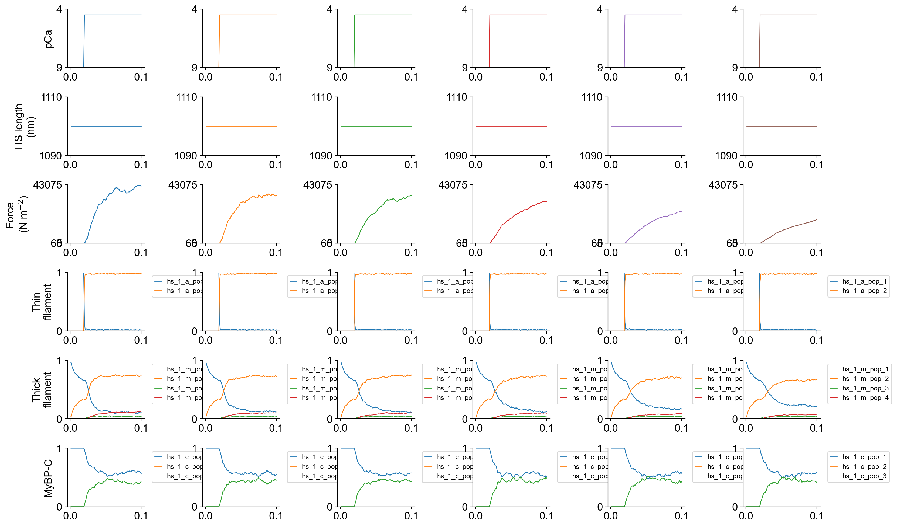
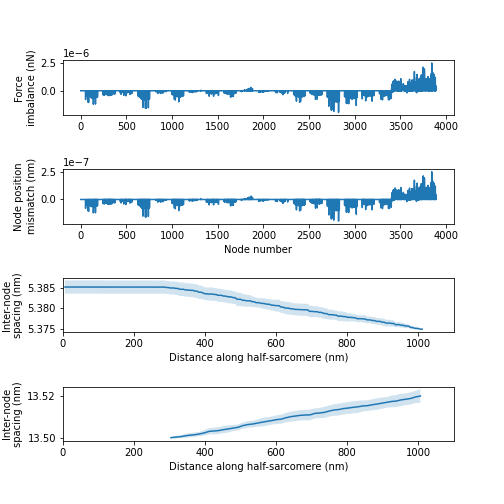
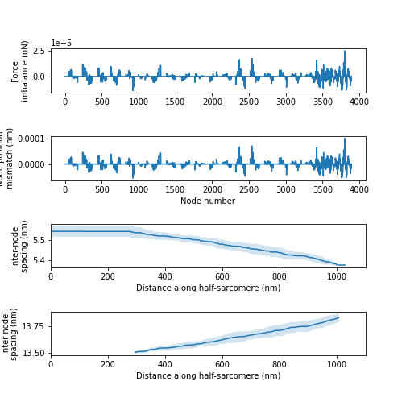

# Force balance

## Overview

This demo runs code that checks that force is balanced (at least to algorithmic precision) at each node in a myofibrillar lattice

## What this demo does

This demo

+ runs simulations for 6 fixed-end activations where the thick and thin filaments have different stiffnesses
+ saves a status file for the last time-point for each simulation
+ calls a demo-specific Python file that
  + loops through the simulations
  + calculates the unbalanced force at each node
  + saves a summary of the results for each simulation as a figure

## Instructions

If you need help with these step, check the [installation instructions](../../../installation/installation.html).

+ Open an Anaconda prompt
+ Activate the FiberSim environment
+ Change directory to `<FiberSim_repo>/code/FiberPy/FiberPy`
+ Run the command
```
 python FiberPy.py characterize "../../../demo_files/validation/force_balance/base/setup.json"
```

+ You should see text appearing in the terminal window, showing that the simulations are running. It may take a few minutes to finish.

### Viewing the results

All of the results from the simulation are written to files in `<FiberSim_repo>/demo_files/validation/force_balance/sim_output`

The file `superposed_traces.png` shows pCa, length, force per cross-sectional area (stress), and thick and thin filament properties for the first half-sarcomere in the myofibril plotted against time.



FiberPy also generated customized figures for this simulation showing, in rows from the top:
+ the unbalanced force at each node
+ the uncertainty in the x position of that node (in nm)
+ the inter-node spacing (mean and standard deviation) on the thin filament
+ the inter-crown spacing (mean and standard deviation) on the thick filament

Here is the figure for the simulation with the stiffest filaments. Note that the thin and thin filaments both extended by ~0.2% and that the unbalanced forces are very small. This last point essentially means that the the [equations](../../../FiberCpp/half_sarcomeres/lattice_equations/lattice_equation.html) governing the position of each node have been [solved](../../../FiberCpp/half_sarcomeres/KX=F/KX=F.html) to high precision.



And here is the simulation with the most compliant filaments. Note the filaments extended in this case by ~2%. The unbalanced forces were also higher in this case (because the node positions are harder to calculate when cross-links induce large relative movements). Nonetheless, the computed answers still have high precision. For reference, if the force-balance calculations omit cMyBP-C links, the unbalanced forces increase by a factor of ~100. 



### How this worked

The setup file is very similar to many other demos on this site.

The [parameter adjustments mode](../../model_comparison/parameter_adjustments/parameter_adjustments.html) was used to run simulations with 6 different filament compliances.

A `post_sim_Python_call` was added to the [characterization](../../../structures/characterization/characterization.html) structure to analyze the status files and calculate the unbalanced forces.

``` text
{
  "FiberSim_setup": {
    "FiberCpp_exe": {
      "relative_to": "this_file",
      "exe_file": "../../../../bin/FiberCpp.exe"
    },
    "model": {
      "relative_to": "this_file",
      "options_file": "sim_options.json",
      "manipulations":
      {
        "base_model": "model.json",
        "generated_folder": "../generated",
        "adjustments":
        [
            {
                "class": "thick_parameters",
                "variable": "m_k_stiff",
                "multipliers": [1, 0.5, 0.25, 0.1, 0.05, 0.025],
                "output_type": "float"
            },
            {
                "class": "thin_parameters",
                "variable": "a_k_stiff",
                "multipliers": [1, 0.5, 0.25, 0.1, 0.05, 0.025],
                "output_type": "float"
            }
        ]
       }
    },
    "characterization": [
        {
            "type": "freeform",
            "relative_to": "this_file",
            "sim_folder": "../sim_data",
            "m_n": 9,
            "protocol_files": ["../protocols/ramp.txt"],
            "output_image_formats": [ "png" ],
            "figures_only": "False",
            "trace_figures_on": "False",
            "post_sim_Python_call": "../Python_code/check_force_balance.py"
        }
    ]
  }
}
```


