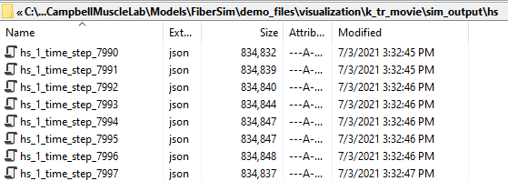
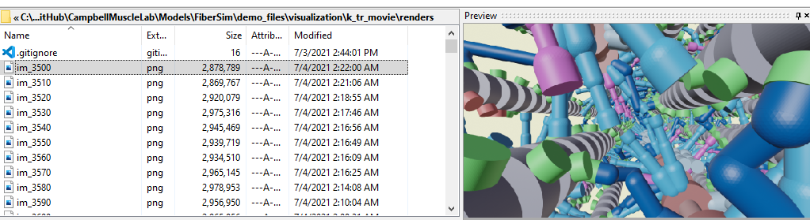
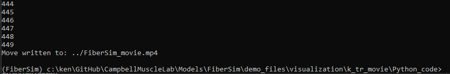
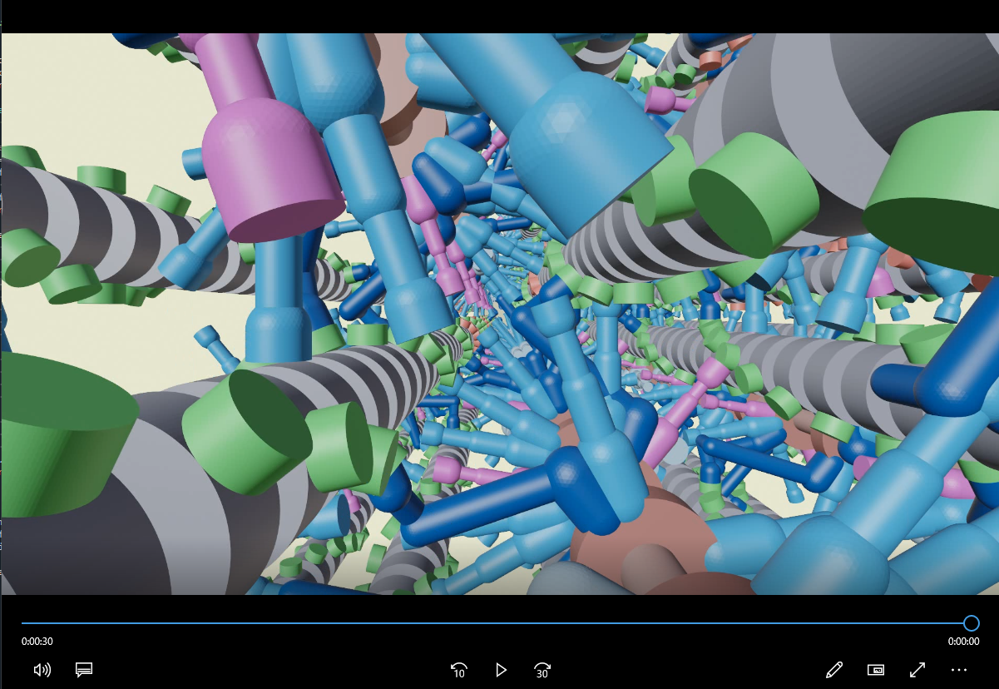
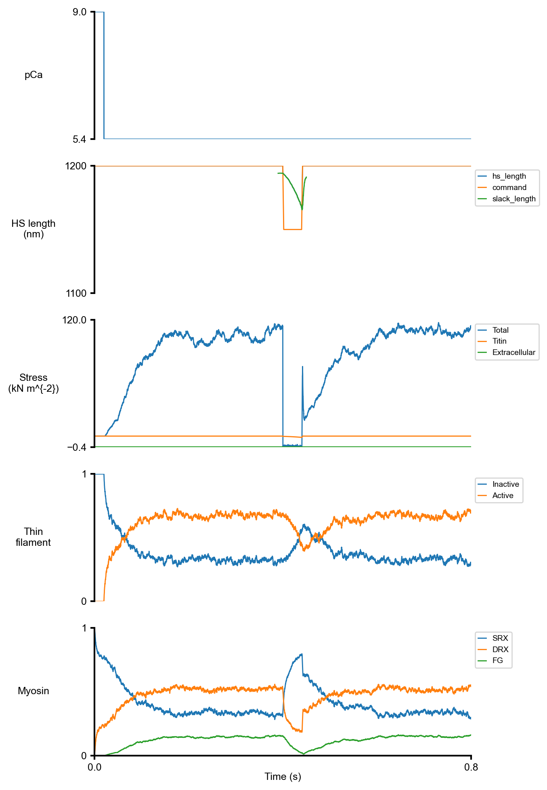

# k<sub>tr</sub> movie

## Overview

This demo shows how to create a sequence of images using Blender and link them together to create a movie showing interfilamentary movement during a k<sub>tr</sub> maneauver.

Note that, as described at the [top level visualization demos page](../../visualization.html), it may take up to ~1 day to complete all of the steps in this demonstration. The rendering is very slow.

## What this demo does

This demo builds on the [multi frame demo](../multi_frame/multi_frame.html) and adds in a movie generation step.

## Instructions

Make sure you have Blender installed as described in the [single frame demo](../single_frame/single_frame.html).

### Getting ready

+ Open an Anaconda Prompt
+ Activate the FiberSim Anaconda Environment by executing:
    ```
    conda activate fibersim
    ```
+ Change directory to `<FiberSim_dir>/code/FiberPy/FiberPy`, where `<FiberSim_dir>` is the directory where you installed FiberSim.

### Create movie

+ Type `python fiberpy.py run_batch ../../../demo_files/visualization/k_tr_movie/batch_run_simulation.json`

+ This command should run a simulation (it may take 20 minutes) and store status files for the time-steps from 3500 to 8000 in `<FiberSim_dir>/demo_files/visualization/k_tr_movie/sim_output/hs`.



+ Now type `python fiberpy.py render_model ../../../demo_files/visualization/k_tr_movie/batch_render.json`

+ This step will *take many hours* but will eventually produce 450 image files in `<FiberSim_dir>/demo_files/visualization/k_tr_movie/renders`.



+ The last step is to run some Python code to merge the image files into a single movie.
  + Change the working directory by typing `cd ../../../demo_files/visualization/k_tr_movie/python_code`
  + Type `python create_movie.py`

You should get text similar to this



You should also find a new movie file `FiberSim_move.mp4` in `<FiberSim_dir>demo_files/visualization/k_tr_movie`

<a href="https://drive.google.com/file/d/1IPY9TCLS1k_Csu-8VDzeUaURNpgLRoIJ/view?usp=sharing" title="FiberSim_movie"></a>

## How this worked

FiberPy created this movie by first running a simulation of a k<sub>tr</sub> experiment. `sim_output/summary_0.png` shows a summary of the simulation.



The code also dumped [status files](../../../structures/status_file/status_file.html) for many of the time-steps.

The next step was to render these status files using a [render batch structure](../../../structures/render_batch/render_batch.html)

````
{
    "render_batch":
    {
        "render_jobs":
        [
            {
                "relative_to": "this_file",
                "template_file": "render_template/render_template.json",
                "frames_file": "frames/frames_k_tr.json",
                "options_file": "render_options/render_options.json"
            }
        ]
        
    }
}
````
In this example, the frames file contains 450 objects. The first few are shown below. Note that each frame is based on a different snapshot and stores a differen image..

````
{
    "frames": [
        {
            "status_file": "sim_output/hs/hs_1_time_step_3500.json",
            "image_file": "renders/im_3500.png",
            "camera": {
                "location": {
                    "x": 875,
                    "y": 30,
                    "z": 17.32
                },
                "rotation": {
                    "x": 90,
                    "y": 0,
                    "z": 90
                }
            }
        },
        {
            "status_file": "sim_output/hs/hs_1_time_step_3510.json",
            "image_file": "renders/im_3510.png",
            "camera": {
                "location": {
                    "x": 875,
                    "y": 30,
                    "z": 17.32
                },
                "rotation": {
                    "x": 90,
                    "y": 0,
                    "z": 90
                }
            }
        },
        {
            "status_file": "sim_output/hs/hs_1_time_step_3520.json",
            "image_file": "renders/im_3520.png",
            "camera": {
                "location": {
                    "x": 875,
                    "y": 30,
                    "z": 17.32
                },
                "rotation": {
                    "x": 90,
                    "y": 0,
                    "z": 90
                }
            }
        },
        {
            "status_file": "sim_output/hs/hs_1_time_step_3530.json",
            "image_file": "renders/im_3530.png",
            "camera": {
                "location": {
                    "x": 875,
                    "y": 30,
                    "z": 17.32
                },
                "rotation": {
                    "x": 90,
                    "y": 0,
                    "z": 90
                }
            }
        },
    <SNIP>
````

The last step is to sort the image files into a [natural order](https://en.wikipedia.org/wiki/Natural_sort_order) and create a movie. This is handled with the Python code `create_movie.py` below.

````

import os
import cv2
import natsort

def create_movie(im_folder, movie_file):
    """ Create movie from folder """
    
    # Get files in folder
    ken=1
    im_files = [os.path.join(im_folder, f) for f in os.listdir(im_folder)
                 if os.path.isfile(os.path.join(im_folder,f))]
    im_files = natsort.natsorted(im_files)
    print(im_files)
    
    im_array=[]
    for f in im_files:
        if not (f.endswith('png')):
            continue
        print(f)
        im = cv2.imread(f)
        height, width, layers = im.shape
        size = (width, height)
        im_array.append(im)
    
    out = cv2.VideoWriter(movie_file,
                          cv2.VideoWriter_fourcc(*'MP4V'),
                          15,
                          size)
    
    for i in range(len(im_array)):
        print(i)
        out.write(im_array[i])
    out.release()
    print('Move written to: %s' % movie_file)
    
    
    
if __name__ == "__main__":
    im_folder = '../renders'
    movie_file = '../FiberSim_movie.mp4'
    
    create_movie(im_folder, movie_file)
````
