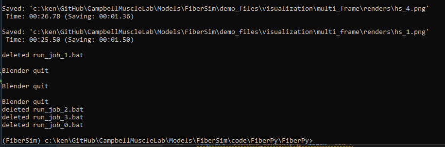
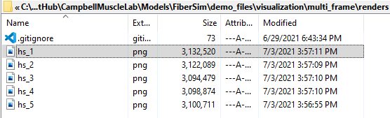
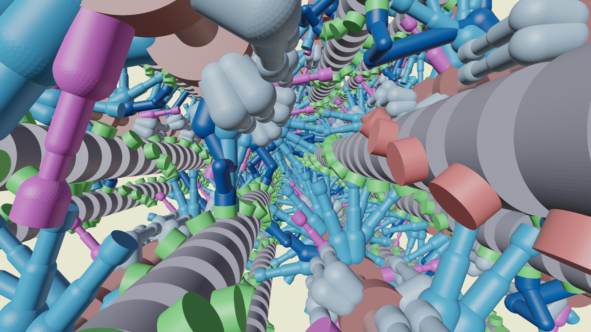
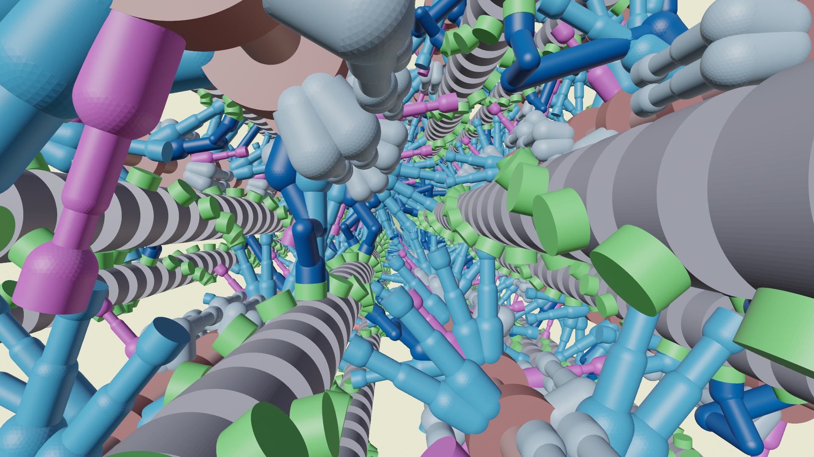
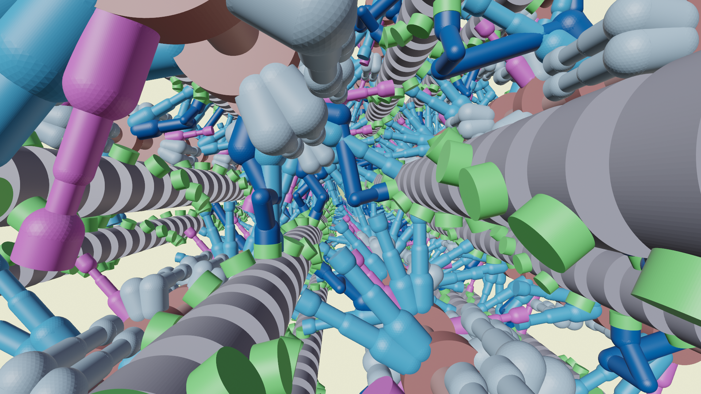
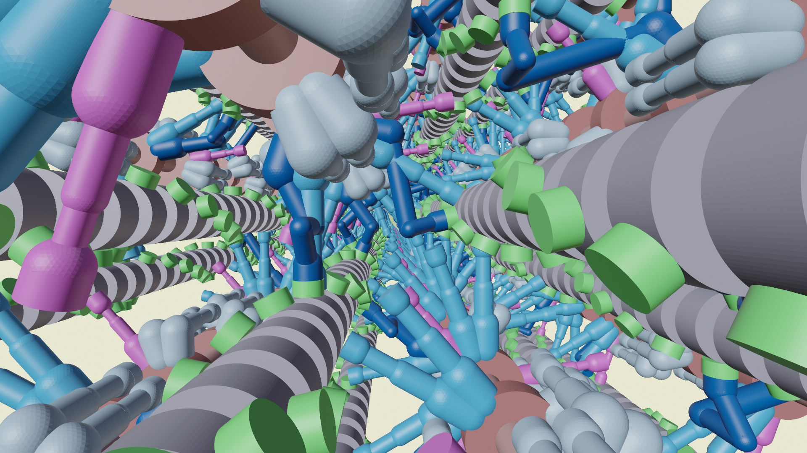

# Multi frame

## Overview

This demo shows how to create a sequence of images using Blender.

## What this demo does

This demo builds on the [single frame demo](../single_frame/single_frame.html) and extends the `frames file` to generate multiple images.

## Instructions

Make sure you have Blender installed as described in the [single frame demo](../single_frame/single_frame.html).

### Getting ready

1. Open an Anaconda Prompt
1. Activate the FiberSim Anaconda Environment by executing:
    ```
    conda activate fibersim
    ```
1. Change directory to `<FiberSim_dir>/code/FiberPy/FiberPy`, where `<FiberSim_dir>` is the directory where you installed FiberSim.

1. Type `python fiberpy.py render_model ../../../demo_files/visualization/multi_frame/batch_render.json`

1. The program should run (it may take a few minutes) and eventually show you text that looks similar to this.



## Viewing the results

+ Use Windows File Explorer to open `<FiberSim_dir>/demo_files/visualization/multi_frame/renders`

+ You should see



The image files are







If you wanted to, you could merge these files together in external software to create a movie.

## How this worked

FiberPy created the image using this [render batch structure](../../../structures/render_batch/render_batch.html)

````
{
    "render_batch":
    {
        "render_jobs":
        [
            {
                "relative_to": "this_file",
                "template_file": "render_template/render_template.json",
                "frames_file": "frames/frames_multi.json",
                "options_file": "render_options/render_options.json"
            }
        ]
        
    }
}
````

The batch consists of a single render job.

The job has
+ a [render_template](../../../structures/render_template/render_template.html)
  + this tells Blender how to draw the scene by sizing and colors of the objects 
+ a [frames file](../../../structures/frames/frames.html)
  + this tells FiberPy which [status files](../../../structures/status_file/status_file.html) to render, the location and orientation of the camera, and where to save the image
+ a [render options file](../../../structures/render_options.html)
  + this tells FiberPy where to find the Blender program and gives some fine-tuning on the rendering.

In this example, the frames file contains 5 objects. Each has a different status file and creates a different output image.

````
{
  "frames": [
    {
      "status_file": "snapshots/hs_1_time_step_400.json",
      "image_file": "renders/hs_1.png",
      "camera": {
        "location": {
          "x": 602.29,
          "y": 51.964,
          "z": 22.383
        },
        "rotation": {
          "x": 88.8,
          "y": 0.698,
          "z": -91.5
        }
      }
    },
    {
      "status_file": "snapshots/hs_1_time_step_410.json",
      "image_file": "renders/hs_2.png",
      "camera": {
        "location": {
          "x": 602.29,
          "y": 51.964,
          "z": 22.383
        },
        "rotation": {
          "x": 88.8,
          "y": 0.698,
          "z": -91.5
        }
      }
    },
    {
      "status_file": "snapshots/hs_1_time_step_420.json",
      "image_file": "renders/hs_3.png",
      "camera": {
        "location": {
          "x": 602.29,
          "y": 51.964,
          "z": 22.383
        },
        "rotation": {
          "x": 88.8,
          "y": 0.698,
          "z": -91.5
        }
      }
    },
    {
      "status_file": "snapshots/hs_1_time_step_430.json",
      "image_file": "renders/hs_4.png",
      "camera": {
        "location": {
          "x": 602.29,
          "y": 51.964,
          "z": 22.383
        },
        "rotation": {
          "x": 88.8,
          "y": 0.698,
          "z": -91.5
        }
      }
    },
    {
      "status_file": "snapshots/hs_1_time_step_440.json",
      "image_file": "renders/hs_5.png",
      "camera": {
        "location": {
          "x": 602.29,
          "y": 51.964,
          "z": 22.383
        },
        "rotation": {
          "x": 88.8,
          "y": 0.698,
          "z": -91.5
        }
      }
    }
  ]
}
````
