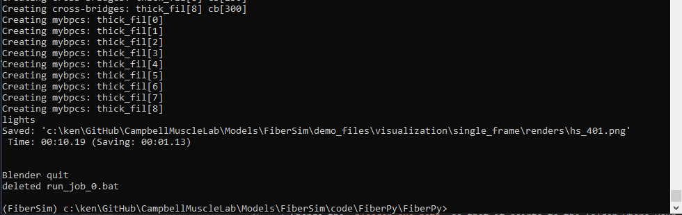
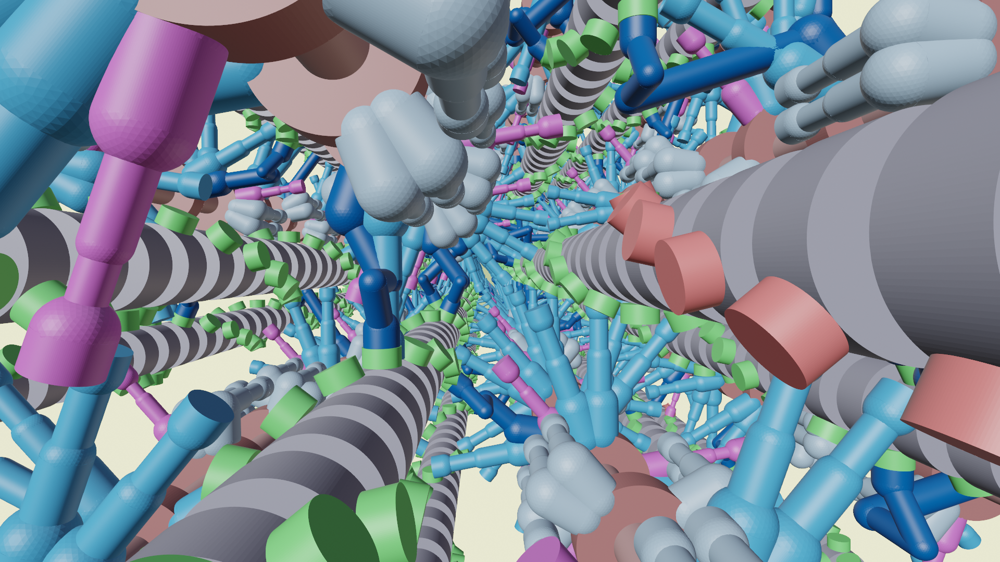

# Single snap shot

## Overview

This demo shows how to create a single snap shot using Blender.

## What this demo does

This demo uses the visualization tool from FiberPy to get a single snap shot from a FiberSim simulation.

## Instructions

### Make sure you have Blender installed

If you do not have Blender installed on your PC

+ [download Blender](https://www.blender.org)
+ install the software accepting all the defaults

### Check the Blender version

This demo assumes that you are using `Blender 2.92`. If that is not correct, you need to update the [render options](../../../structures/render_options/render_options.html)

+ Open `<FiberSim_dir>/demo_files/visualization/single_frame/render_options/render_options.json`

+ You should see this
````
  {
    "render_options":
    {
        "blender_exe_path": "C:/Program Files/Blender Foundation/Blender 2.92",
        "max_render_distance": 500,
        "max_smooth_distance": 200,
        "background_mode": true
    }
}
````

+ Change the `blender_exe_path` so that it points to the folder where your `blender.exe` file is located.

### Getting ready

1. Open an Anaconda Prompt
1. Activate the FiberSim Anaconda Environment by executing:
    ```
    conda activate fibersim
    ```
1. Change directory to `<FiberSim_dir>/code/FiberPy/FiberPy`, where `<FiberSim_dir>` is the directory where you installed FiberSim.

1. Type `python fiberpy.py render_model ../../../demo_files/visualization/single_frame/batch_render.json`

1. The program should run (it may take a few minutes) and eventually show you text that looks similar to this.



## Viewing the results

+ Use Windows File Explorer to open `<FiberSim_dir>/demo_files/visualization/single_frame/renders`

+ You should see
  + hs_401.png
  



## How this worked

FiberPy created the image using this [render batch structure](../../../structures/render_batch/render_batch.html)

````
{
    "render_batch":
    {
        "render_jobs":
        [
            {
                "relative_to": "this_file",
                "template_file": "render_template/render_template.json",
                "frames_file": "frames/frames.json",
                "options_file": "render_options/render_options.json"
            }
        ]
        
    }
}
````

The batch consists of a single render job.

The job has
+ a [render_template](../../../structures/render_template/render_template.html)
  + this tells Blender how to draw the scene by sizing and colors of the objects 
+ a [frames file](../../../structures/frames/frames.html)
  + this tells FiberPy which [status files](../../../structures/status_file/status_file.html) to render, the location and orientation of the camera, and where to save the image
+ a [render options file](../../../structures/render_options.html)
  + this tells FiberPy where to find the Blender program and gives some fine-tuning on the rendering.

In this example, the frames file is very simple.

````

    "frames":
    [
      {
        "status_file": "snapshots/hs_1_time_step_401.json",
        "image_file": "renders/hs_401.png",
        "camera": {
          "location": {
            "x": 602.29,
            "y": 51.964,
            "z": 22.383
          },
          "rotation": {
            "x": 88.8,
            "y": 0.698,
            "z": -91.5
          }
        }
      }
   ]
}
````

This tells FiberPy to:

+ render the status file at `snapshots/hs_1_time_step_401.json`
+ save the image to `renders/hs_401.png`
+ using a camera that is
  + positioned at
    + x = 602.29
    + y = 51.964
    + z = 22.383
  + and is pointing in a direction defined by rotational coordinates of
    + x = 88.8
    + y = 0.698
    + z = -91.5

If you need more information about cameras in Blender, consult [their documentation](https://docs.blender.org/).


