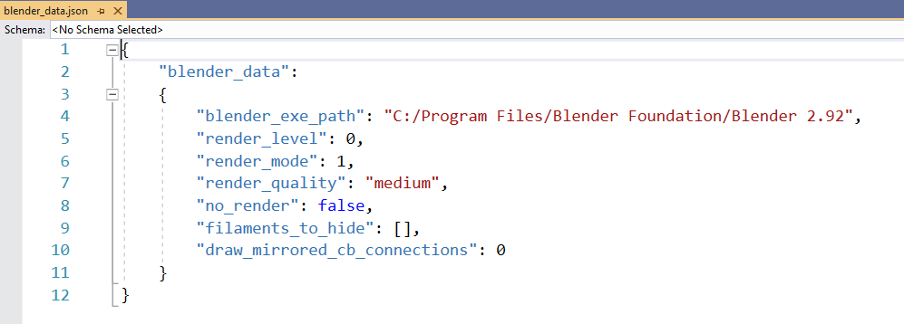
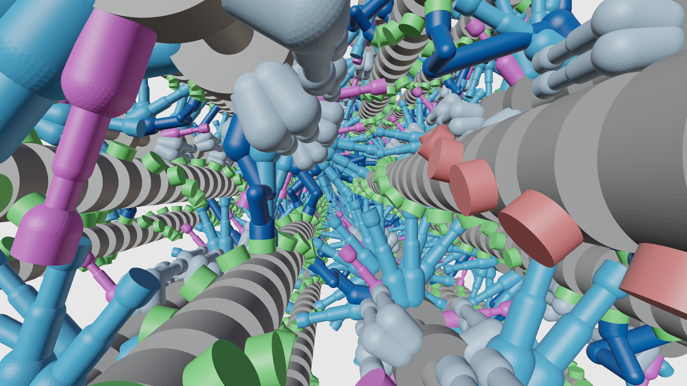

# Single snap shot

## Overview

This demo shows how to create a single snap shot using Blender.

## What this demo does

This demo uses the visualization tool from FiberPy to get a single snap shot from a FiberSim simulation.

## Instructions

### Download Blender

First, download Blender at https://www.blender.org/. This model utilizes Blender 2.92. If your edition is different than this, navigate to `<FiberSim_dir>/demo_files/visualization/single_frame` and open `blender_data.json` as a text file. Change the instance of "Blender 2.9.2" to your current version. 




### Getting ready

1. Open an Anaconda Prompt
2. Activate the FiberSim Anaconda Environment by executing:
    ```
    conda activate fibersim
    ```
3. Change directory to `<FiberSim_dir>/code/FiberPy/FiberPy`, where `<FiberSim_dir>` is the directory where you installed FiberSim.

4. Type `python fiberpy.py render_model ../../../demo_files/visualization/single_frame/render_batch.json`

5. A Blender window will open during the process, and close when the rendering is over.

## Viewing the results

+ Use Windows File Explorer to open `<repo>/demo_files/visualization/single_frame/renders`
+ You should see
  + hs_401.png
  
<p align="center">
    
</p>
