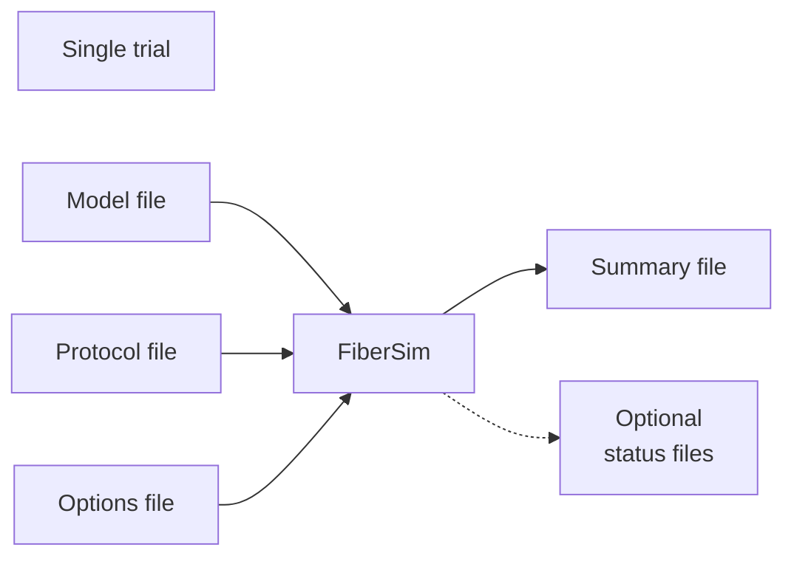

# Framework

## Overview

The FiberSim framework consists of two components:

+ FiberCpp - the core model, written in C++ for speed, that simulates the mechanical properties of one or more sarcomeres connected in series
+ FiberPy - a set of files, written in Python for ease of use, that simplifies running and analyzing simulations.

Every modeling task can be broken down into one or more simulation(s). For example, you could run a single simulation to predict force at maximum Ca<sup>2+</sup> activation. Alternatively, you could run a series of simulations to predict how force varies as a function of Ca<sup>2+</sup>. The [demos](../demos/demos.html) provide many different kinds of exmaple.

To run a single simulation, you launch FiberCpp with three files:
+ `model file` - describes the system (e.g. number of sarcomeres in series, kinetic scheme for myosin, etc.) you want to simulate
+ `protocol file` - describes the experiment you want to run (e.g. step the Ca<sup>2+</sup> concentration to pCa 4.5 and implement a step stretch of 100 nm after 2 s)
+ `options file` - define tolerances for calculations and/or choose to write files that describe the status of each sarcomere at given time-points

FiberCpp will perform the calculations and create an output file that summarizes the properties of the muscle system (e.g. force, length, number of bound myosin heads etc.) at each time-point. Depending on the options that were specified, it may also produce a series of status files that provide even more information about the muscle system.



If you wanted, you <i>could</i> run this simulation from the command line by changing to the appropriate directory and typing

`FiberCpp model_file.json protocol_file.txt options_file.json output_summary.txt`

In practice, this would get pretty tedious for most real-life simulation tasks. A better alternative is to define the simulation using a `FiberSim_batch` written in JSON format.

```
{
    "FiberSim_batch":
    {
        "FiberCpp_exe":
        {
            "exe_file": "C:/FiberSim/bin/FiberCpp.exe"
        },
        "job":
        [
            {
                "relative_to": "False",
                "model_file": "c:/temp/model_1.txt",
                "protocol_file": "c:/temp/protocol_1.txt",
                "options_file": "c:/temp/options_1.json",
                "results_file": "c:/temp/results_1.txt"
            }
        ]
    }
}
```

You can then launch FiberPy with this file. The Python code will load the batch structure and run the simulation defined by the job. The command would be

`python FiberPy.py run_batch batch_file.json`

This might not seem like a big advantage until you realize that the job element in the JSON structure is actually an array. In the example above, the array had just a single entry, so FiberPy ran only one simulation. However, you can set the job array to have as many entries as you want.

For example, you could simulate a muscle at 3 different Ca<sup>2+</sup> concentrations with this batch file.

```
{
    "FiberSim_batch":
    {
        "FiberCpp_exe":
        {
            "exe_file": "C:/FiberSim/bin/FiberCpp.exe"
        },
        "job":
        [
            {
                "relative_to": "False",
                "model_file": "c:/temp/model.txt",
                "protocol_file": "c:/temp/protocol_Ca_1.txt",
                "options_file": "c:/temp/options.json",
                "results_file": "c:/temp/results_1.txt"
            },
            {
                "relative_to": "False",
                "model_file": "c:/temp/model.txt",
                "protocol_file": "c:/temp/protocol_Ca_2.txt",
                "options_file": "c:/temp/options.json",
                "results_file": "c:/temp/results_2.txt"
            },
            {
                "relative_to": "False",
                "model_file": "c:/temp/model.txt",
                "protocol_file": "c:/temp/protocol_Ca_3.txt",
                "options_file": "c:/temp/options.json",
                "results_file": "c:/temp/results_3.txt"
            }
        ]
    }
}
```

When launched with this batch file, FiberPy will simulate the same model using 3 different protocols, writing the results for each simulation to a separate file.

The next step is to add some simple analyses. For example, it's often useful to see the results of the simulations as a figure.

```
{
    "FiberSim_batch":
    {
        "FiberCpp_exe":
        {
            "exe_file": "C:/FiberSim/bin/FiberCpp.exe"
        },
        "job":
        [
            {
                "relative_to": "False",
                "model_file": "c:/temp/model.txt",
                "protocol_file": "c:/temp/protocol_Ca_1.txt",
                "options_file": "c:/temp/options.json",
                "results_file": "c:/temp/results_1.txt"
            },
            {
                "relative_to": "False",
                "model_file": "c:/temp/model.txt",
                "protocol_file": "c:/temp/protocol_Ca_2.txt",
                "options_file": "c:/temp/options.json",
                "results_file": "c:/temp/results_2.txt"
            },
            {
                "relative_to": "False",
                "model_file": "c:/temp/model.txt",
                "protocol_file": "c:/temp/protocol_Ca_3.txt",
                "options_file": "c:/temp/options.json",
                "results_file": "c:/temp/results_3.txt"
            }
        ]
    },
    "superposed_traces":
    [
        {
            "relative_to": "False",
            "results_folder": "c:/temp",
             "C:\\ken\\GitHub\\CampbellMuscleLab\\models\\FiberSim\\demo_files\\isotypes\\switching\\sim_data\\sim_output",
                    "output_image_file": "C:\\ken\\GitHub\\CampbellMuscleLab\\models\\FiberSim\\demo_files\\isotypes\\switching\\sim_data\\sim_output\\superposed_traces",
                    "output_image_formats": [
                        "png"
                    ]
                }
            ]


}
```


"superposed_traces": [
                {
                    "relative_to": "False",
                    "results_folder": "C:\\ken\\GitHub\\CampbellMuscleLab\\models\\FiberSim\\demo_files\\isotypes\\switching\\sim_data\\sim_output",
                    "output_image_file": "C:\\ken\\GitHub\\CampbellMuscleLab\\models\\FiberSim\\demo_files\\isotypes\\switching\\sim_data\\sim_output\\superposed_traces",
                    "output_image_formats": [
                        "png"
                    ]
                }
            ]


FiberPy is a suite of software tools witten in Python that make it easier to use the core [FiberCpp](../FiberCpp/FiberCpp.html) model to

+ run simulations
+ analyze the output of the simulation
+ make figures

FiberPy can also use [Blender](http://www.blender.org) to create snapshots of the model and movies.

While speed is the most important factor for the core model, flexibility is more important for FiberPy. The suite is therefore written in Python making extensive use of existing libraries including [Numpy](https://numpy.org/) and [Pandas](https://pandas.pydata.org/).

The [demos](../demos/demos.html) provide many examples.