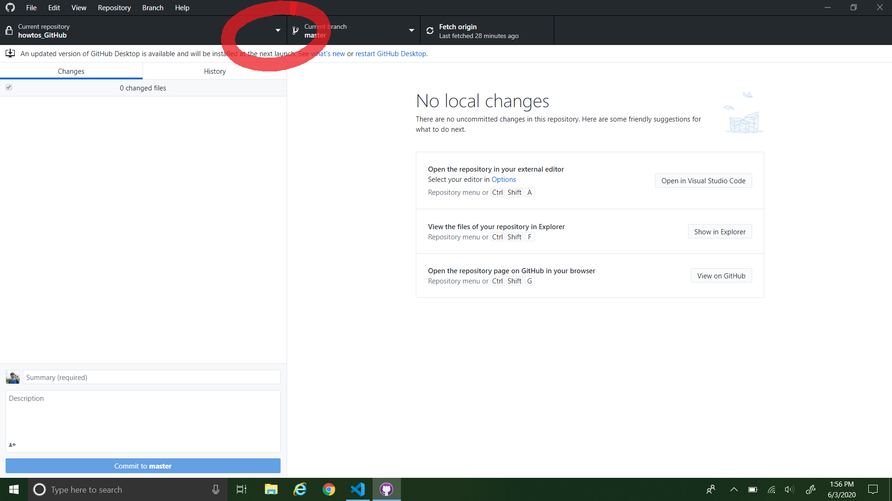
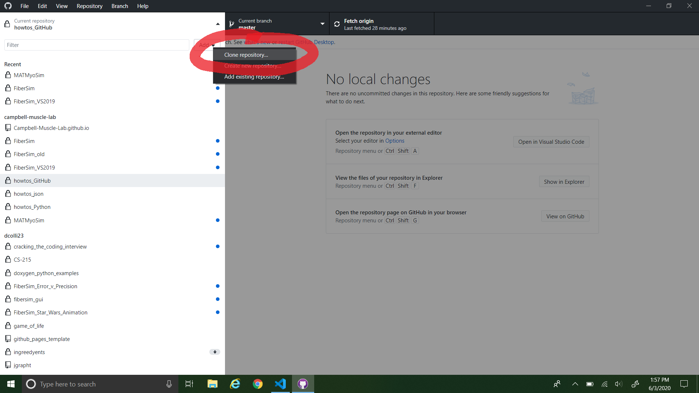
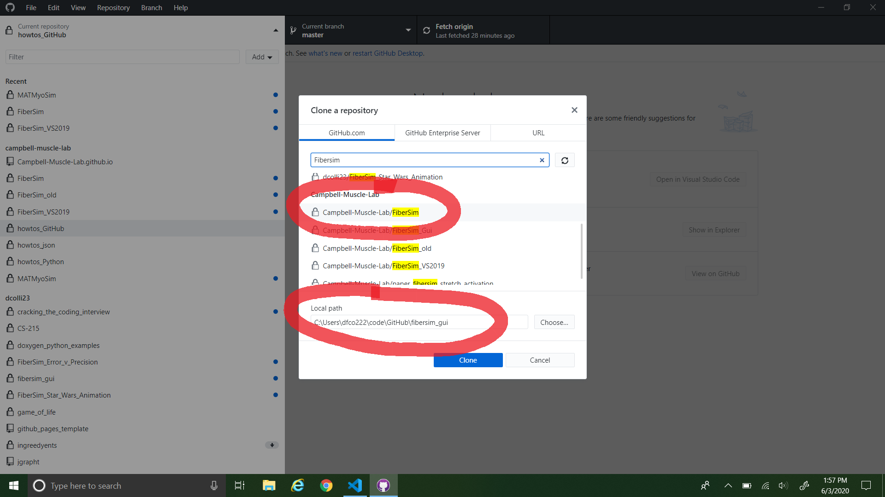

# Cloning FiberSim
{:.no_toc}

* TOC
{:toc}

This page instructs you on how to clone the FiberSim repository.

For cloning the FiberSim repository, we recommend using the GitHub Desktop client. You can download the installer for this at [this link](https://desktop.github.com/).

To clone the repo:

1. Open GitHub Desktop and click the dropdown menu for repositories. 
  
2. Click the "Add" dropdown menu.
  
3. Click the "Clone repository..." button.
  
4. Type "FiberSim" into the repository search bar.
  
5. Click the `campbell-muscle-lab/FiberSim` repository, describe where you would like the repository to be located on your local machine, then click "Clone".
  
