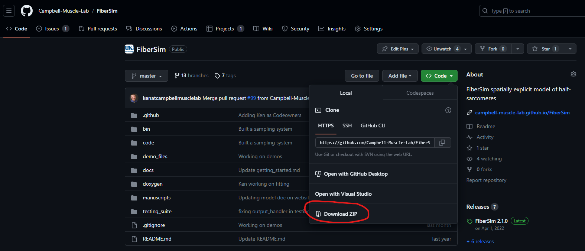
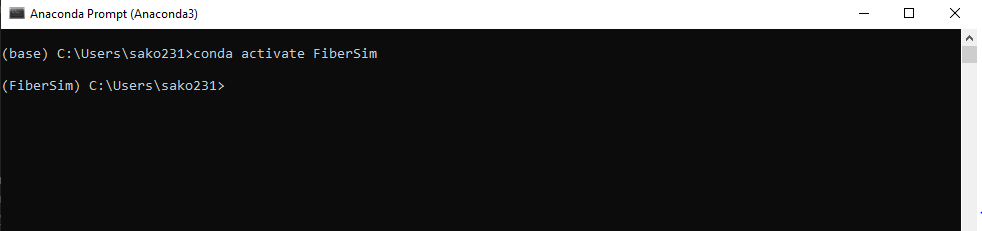

# Installation

This page discusses how to install FiberSim and the necessary support software.

## Downloading the FiberSim software

The FiberSim project is [hosted on GitHub](https://github.com/campbell-muscle-lab/FiberSim).

If you are used to GitHub, you will probably want to clone the respository. [This page](https://campbell-muscle-lab.github.io/howtos_GitHub/pages/github_repos/github_repos.html) provides some help.

If you are new to GitHub, it is probably easier to download a zip file of the repository. Once you have done that, un-zip the archive in a folder where you have write access, for example, `c:/users/your_name/documents/FiberSim`.



With both approaches, you probably want to check that your directory structure looks something like this.

```
C:\Users\<user-name>\Documents\FiberSim
                      |
                      |- bin\
                      |- code\
                      |- demo_files\
                      |- docs\
                      |- doxygen\
                      |- .gitignore
                      |- README.md  
```

## Installing Anaconda

To use FiberSim, you need to have Python installed on your computer. The easiest way to do this is by installing Anaconda.

+ Download Anaconda from [https://www.anaconda.com/download](https://www.anaconda.com/download)

+ Install the software accepting all the defaults.

## Creating the FiberSim environment 

Anaconda supports *environments* which ensure that the Python packages FiberSim needs are kept up to date and consistent.

+ Open an Anaconda Prompt (most simply, from the Windows Start Menu)

+ The command prompt shows the directory you are currently in. Most of the time, the directory is `C:\Users\<user-name>`. You need to change the directory to `<FiberSim_repo>\code\FiberPy\environment`, where `<FiberSim_repo>` is the top-level folder for the repository you cloned or downloaded from GitHub.

+ To navigate inside the folders, use the "change directory command" (`cd`), for example
````
cd <user_name>\Documents\FiberSim\code\FiberPy\environment`
````

+ Now type

```
conda env create -f environment.yml
```

and press `Enter`. Anaconda will handle the download and installation of all dependencies.

## Using The FiberSim Environment

Each time you want to run FiberSim simulations, you need to launch an Anaconda Prompt to write the command lines. Your first command line should always be to *activate* the FiberSim environment. To do so:

1. Open an Anaconda Prompt
2. Type:

```
conda activate FiberSim
```

You will notice that "base" is now changed to "FiberSim" in the prompt command. 

<p align="center">

</p>

You are now ready to try the first [demo](../demos.html)!