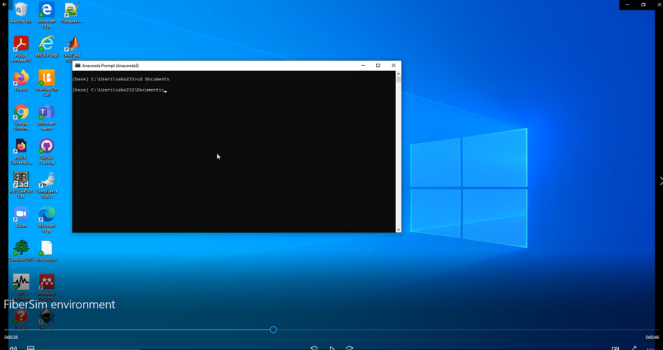

# Installation

This page discusses how to install FiberSim and the necessary support software.

## Downloading the FiberSim software

FiberSim is available for free download under the GPL3 license. The latest release in hosted on Zenodo and can be downloaded [here](https://doi.org/10.5281/zenodo.4929389). 

1. Download the .zip file hosted on <https://doi.org/10.5281/zenodo.4929389>. Make sure you download version 2.0.1.
2. Extract the data. We recommend to use a simple path to extract them, such as `C:\Users\<user-name>\Documents`.
3. Rename the extracted folder to `FiberSim` (instead of `Campbell-Muscle-Lab-FiberSim-xxxxxx`).
4. Make sure the `FiberSim` folder look like this:

```
C:\Users\<user-name>\Documents\FiberSim
                      |
                      |- bin\
                      |- code\
                      |- demo_files\
                      |- docs\
                      |- doxygen\
                      |- manuscripts\           
                      |- .gitignore
                      |- README.md  
                      |- README.txt                                                                              
```

## Installing Anaconda

Go to <https://www.anaconda.com/products/individual#windows>, and download the “Python 3.8 version.” Accept all default settings. 

## Activating Anaconda Environment 

FiberSim utilizes the Anaconda platform for managing external python packages. Anaconda is great because it handles all of the external downloads for you, given a special “environment” file. If you would like to learn more about Anaconda and how we in the Campbell Muscle Lab use it, click [this link](http://campbell-muscle-lab.github.io/howtos_Python).

Before running any FiberSim simulation, you have to install the FiberSim environment.

1. Open an Anaconda Prompt by typing "Anaconda Prompt" in the Windows Start Menu
2. The command prompt shows the directory you are currently in. Most of the time, the directory is `C:\Users\<user-name>`. You need to change the directory to `<FiberSim_dir>\code\FiberPy\environment`, where `<FiberSim_dir>` is the directory where you downloaded the FiberSim software. To navigate inside the folders, use the "change directory command" (`cd`), as shown here: [](https://drive.google.com/file/d/1G35iWH8s4GdUy5jJHskBeqYWCf2N5z9T/view?usp=sharing)

3. Type the following in the prompt:

```
conda env create -f environment.yml
```

and press `Enter`. Anaconda will handle the download and installation of all dependencies.

## Using The FiberSim Environment

Each time you want to run FiberSim simulations, you need to launch an Anaconda Prompt to write the command lines. Your first command line should always be to *activate* the FiberSim environment. To do so:

1. Open an Anaconda Prompt
2. Type:

```
conda activate FiberSim
```

You will notice that "base" is now changed to "FiberSim" in the prompt command. 

<p align="center">

</p>

You are now ready to try the first [demo](../demos/getting_started/getting_started.html)!