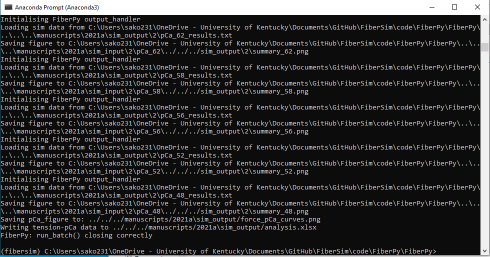
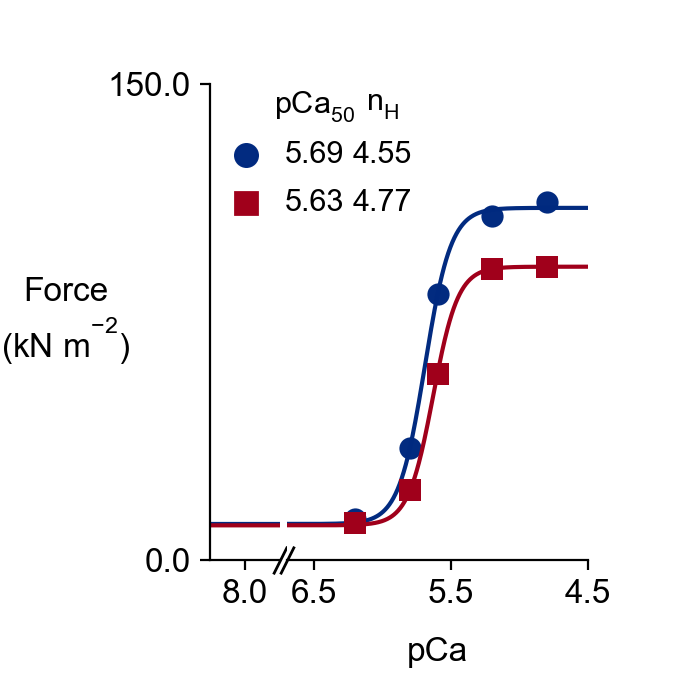
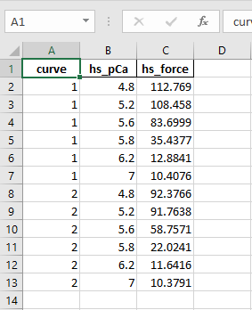
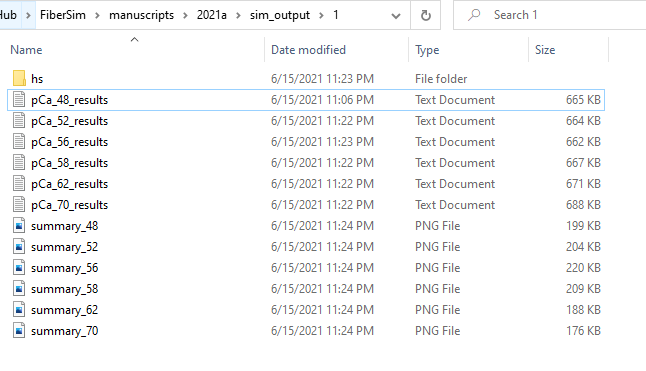
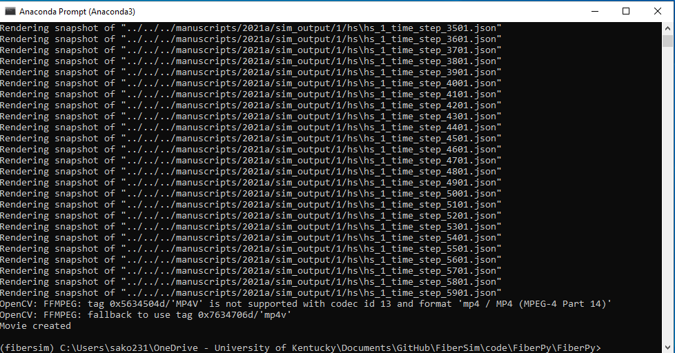
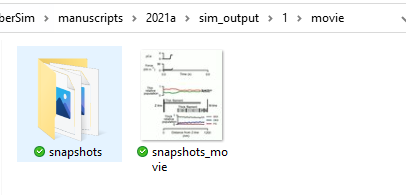
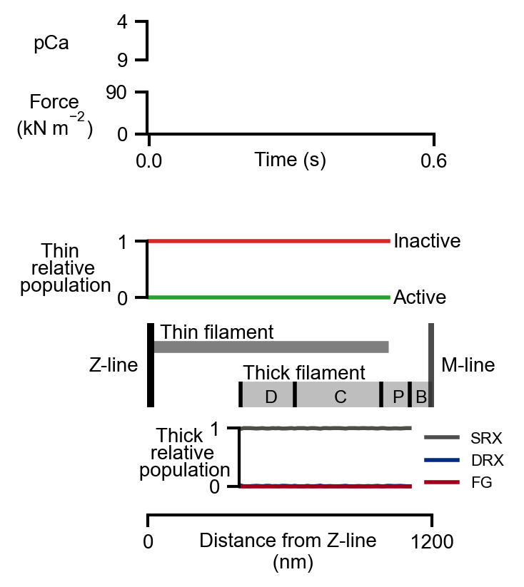

# 2021a
{:.no_toc}

This page shows how to reproduce tension-pCa curves with and without a SRX stabilazing effect of the myosin-binding protein-C (MyBP-C). 

## Tension-pCa curves

### Getting ready

+ Open an Anaconda Prompt

+ Activate the FiberSim Anaconda Environment by executing:
```
conda activate fibersim
```
+ Change directory to `<FiberSim_dir>/code/FiberPy/FiberPy`, where `<FiberSim_dir>` is the directory where you installed FiberSim.

### Run the simulations

+ Type:
 ```
python FiberPy.py run_batch "../../../manuscripts/2021a/batch_pCa_curves.json"
 ```

+ You should see text appearing in the terminal window, showing that the simulations are running. When it finishes (this may take ~30 min), you should see something similar to the image below.



The simulations may take ~30 min.

### Viewing the results

The tension-pCa curves for the control (blue) and the MyBP-C stabilized SRX (red) cases are saved in `<FiberSim_dir>/manuscripts/2021a/sim_output/force_pCa_curves.png`.



The underlying data are stored in `<FiberSim_dir>/manuscripts/2021a/sim_output/analysis.xlsx`.



The subfolders `<FiberSim_dir>/manuscripts/2021a/sim_output/1` and `<FiberSim_dir>/manuscripts/2021a/sim_output/2` contain the simulations results for each pCa value in each case (base and MyBP-C stabilized SRX).



## Spatial visualization

It is possible to generate snapshots showing the spatial distributions of the actin and myosin populations. Two movies can be generated from the snapshots (one .mp4 movie for the control case, and another one for the MyBP-C stabilized SRX case).

### Run the simulations

To generate the control movie:

+ Type:
 ```
python Fiberpy.py spatial_visualization "../../../manuscripts/2021a/sim_output/1/hs" "../../../manuscripts/2021a/sim_output/1/movie"
 ```

+ You should see text appearing in the terminal window, showing that the simulations are running. 



When it finishes (this may take ~2 min), you should a new folder created in `<repo>/manuscripts/2021a/sim_output/1` called "movie".



This folder contains the animated movie.

<a href="snapshots_movie.mp4" title="Link Title"></a>


To generate the MyBP-C stabilized SRX movie:

+ Type:
 ```
python Fiberpy.py spatial_visualization "../../../manuscripts/2021a/sim_output/2/hs" "../../../manuscripts/2021a/sim_output/2/movie"
 ```

+ You should see text appearing in the terminal window, showing that the simulations are running. When it finishes (this may take ~2 min), you should a new folder created in `<repo>/manuscripts/2021a/sim_output/2` called "movie", and containing the snapshots and the .mp4 movie.

