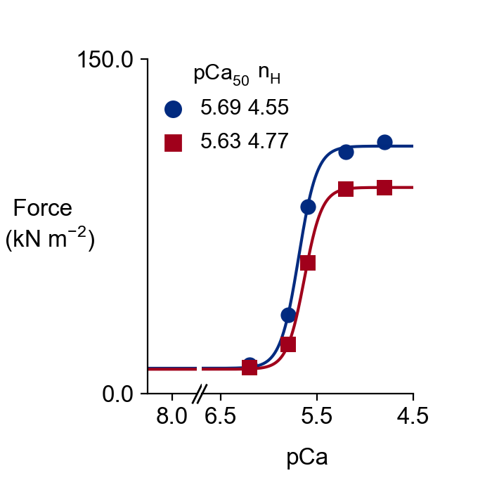

# 2021a
{:.no_toc}

This page shows how to reproduce tension-pCa curves with and without a SRX stabilazing effect of the myosin-binding protein-C (MyBP-C). 

## Tension-pCa curves

### Getting ready

+ Open an Anaconda Prompt

+ Activate the FiberSim Anaconda Environment by executing:
```
conda activate fibersim
```
+ Change directory to `<repo>/code/FiberPy/FiberPy`, where `<repo>` is the directory where you installed FiberSim

### Run the simulations

+ Type:
 ```
python FiberPy.py run_batch "../../../manuscripts/2021a/batch_pCa_curves.json"
 ```

+ You should see text appearing in the terminal window, showing that the simulations are running. When it finishes (this may take ~30 min), you should see something similar to the image below.


### Viewing the results

The tension-pCa curves for the control (blue) and the MyBP-C stabilzed SRX (red) cases are saved in `<repo>/manuscripts/2021a/sim_output/force_pCa_curves.png`.



## Spatial visualization

It is possible to generate snapshots showing the spatial distributions of the actin and myosin populations. Two movies can be generated from the snapshots (one .mp4 movie for the control case, and another one for the MyBP-C stabilzed SRX case).

### Run the simulations

To generate the control movie:

+ Type:
 ```
python Fiberpy.py spatial_visualization "../../../manuscripts/2021a/sim_output/1/hs" "../../../manuscripts/2021a/sim_output/1/movie"
 ```

+ You should see text appearing in the terminal window, showing that the simulations are running. When it finishes (this may take ~2 min), you should a new folder created in `<repo>/manuscripts/2021a/sim_output/1` called "movie", and containing snapshots and an .mp4 file.


To generate the MyBP-C stabilized SRX movie:

+ Type:
 ```
python Fiberpy.py spatial_visualization "../../../manuscripts/2021a/sim_output/1/hs" "../../../manuscripts/2021a/sim_output/1/movie"
 ```

+ You should see text appearing in the terminal window, showing that the simulations are running. When it finishes (this may take ~2 min), you should a new folder created in `<repo>/manuscripts/2021a/sim_output/2` called "movie", and containing snapshots and an .mp4 file.

