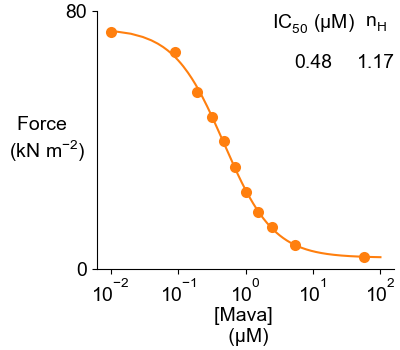
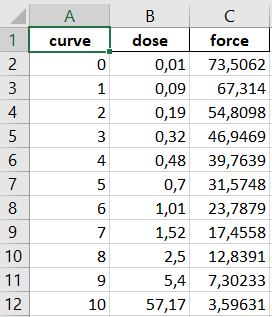

# Mavacamten

This page shows how to reproduce a dose-dependent response curve to a myotrope (Mavacamten).

## Getting ready

+ Open an Anaconda Prompt

+ Activate the FiberSim Anaconda Environment by executing:
```
conda activate fibersim
```
+ Change directory to `<FiberSim_dir>/code/FiberPy/FiberPy`, where `<FiberSim_dir>` is the directory where you installed FiberSim.

## Run the simulations

+ Type:
 ```
python FiberPy.py run_batch "../../../manuscripts/2021b/myotrope/batch_mava.json"
 ```

+ You should see text appearing in the terminal window, showing that the simulations are running. When it finishes (this may take ~15 min), you should see something similar to the image below.


## Viewing the results

The dose-dependent response is stored in `<FiberSim_dir>/manuscripts/2021b/myotrope/sim_output` 



The underlying data are stored in `<FiberSim_dir>/manuscripts/2021b/myotrope/sim_output/analysis.xlsx`



The 10 subfolders from `<FiberSim_dir>/manuscripts/2021b/myotrope/sim_output` contain the simulations results and summary figures for each Mavacamten concentration.


