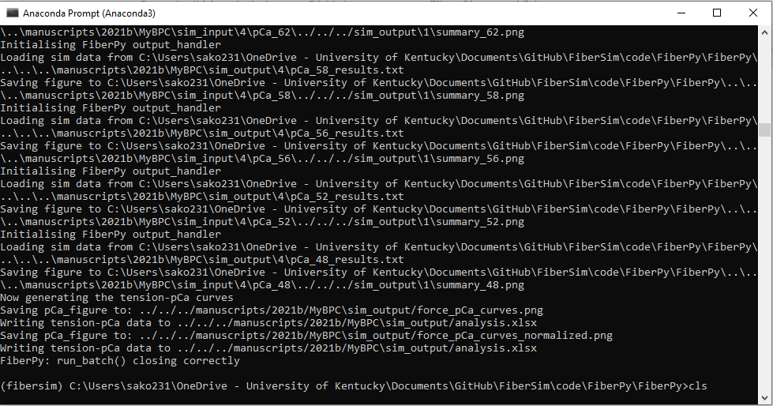
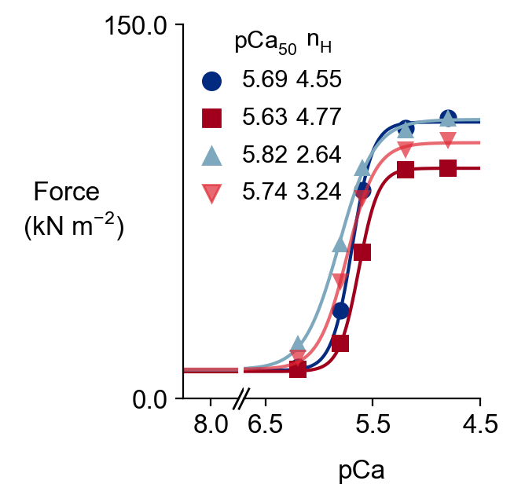
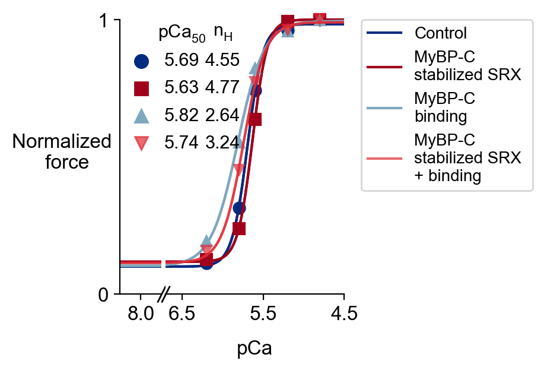
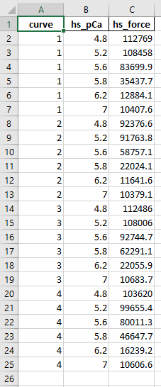
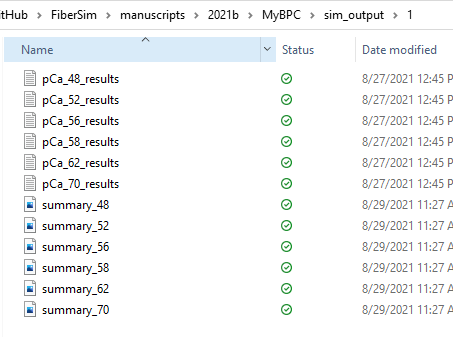

# MyBPC

This page shows how to reproduce 4 tension-pCa curves corresponding to 4 conditions:

+ Base case 
+ MyBPC stabilizing SRX
+ MyBPC binding to actin
+ MyBPC stabilizing SRX + binding to actin


## Getting ready

+ Open an Anaconda Prompt

+ Activate the FiberSim Anaconda Environment by executing:
```
conda activate fibersim
```
+ Change directory to `<FiberSim_dir>/code/FiberPy/FiberPy`, where `<FiberSim_dir>` is the directory where you installed FiberSim.

## Run the simulations

+ Type:
 ```
python FiberPy.py run_batch "../../../manuscripts/2021b/MyBPC/batch_pCa_curves.json"
 ```

+ You should see text appearing in the terminal window, showing that the simulations are running. When it finishes (this may take ~1-2 hour), you should see something similar to the image below.



## Viewing the results

The tension-pCa curves for the four cases are saved in `<FiberSim_dir>/manuscripts/2021b/MyBPC/sim_output/force_pCa_curves.png`.

The normalized tension-pCa curves are saved in `<FiberSim_dir>/manuscripts/2021b/MyBPC/sim_output/force_pCa_curves_normalized.png`.




The underlying data are stored in `<FiberSim_dir>/manuscripts/2021b/MyBPC/sim_output/analysis.xlsx`.



The 4 subfolders from `<FiberSim_dir>/manuscripts/2021b/MyBPC/sim_output` contain the simulations results and summary figures for each pCa value in each case (base, MyBPC stabilized SRX, MyBPC actin binding, and MyBPC stabilized SRX + MyBPC actin binding).




