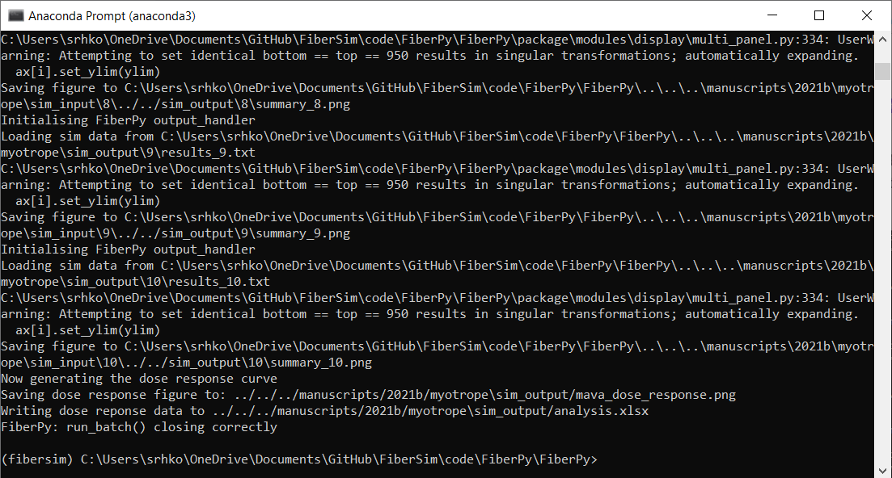
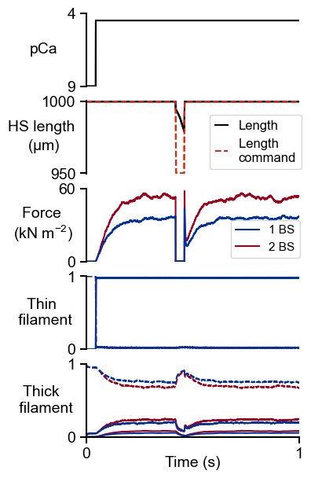
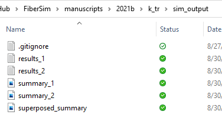
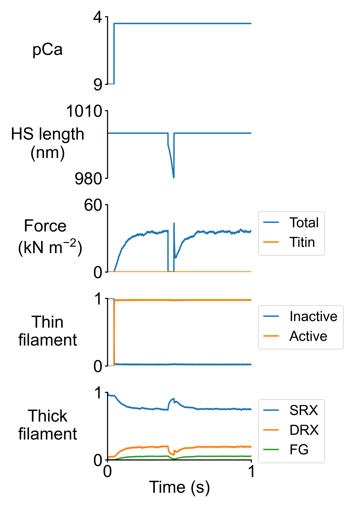
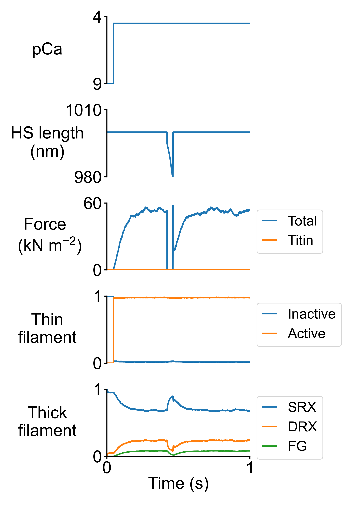

# k_tr

This page shows how to reproduce a slack/re-stretch simulation for two conditions:

+ Myosin heads are able to bind to the nearest actin binding site only (1 potential binding site)

+ Myosin heads are able to bind to one of the three nearest acting binding sites (3 potential binding sites)

## Getting ready

+ Open an Anaconda Prompt

+ Activate the FiberSim Anaconda Environment by executing:
```
conda activate fibersim
```
+ Change directory to `<FiberSim_dir>/code/FiberPy/FiberPy`, where `<FiberSim_dir>` is the directory where you installed FiberSim.

## Run the simulations

+ Type:
 ```
python FiberPy.py run_batch "../../../manuscripts/2021b/k_tr/batch_k_tr.json"
 ```

+ You should see text appearing in the terminal window, showing that the simulations are running. When it finishes (this may take ~20 min), you should see something similar to the image below.



## Viewing the results

The figure showing results for both simulations is stored in `<FiberSim_dir>/manuscripts/2021b/k_tr/sim_output/superposed_summary.png`



Summary figures and results files for the individual simulations are also stored in `<FiberSim_dir>/manuscripts/2021b/k_tr/sim_output`.



<figure class="left">
  
  
</figure>


