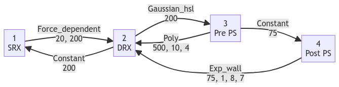

# Kinetic scheme

FiberSim defines how myosin heads and myosin binding protein C molecules transition between different states using structures called kinetic schemes.

FiberSim is agnostic about the actual schemes to use for simulations. The code was specifically designed so that it was flexible. Selecting the appropriate scheme is best left to the user and their goals. The demos provide several different examples but each user (and sometimes each reviewer!) will have opinions as to what they think is best.

The best advice the FiberSim team can provide is for the user to use the simplest scheme that reproduces the effects they are interested in. More complex schemes can produce more complex behaviors but also require more assumptions.

## Overview

Schemes are described in the model file using JSON format.

The model file should contain scheme information for myosin (labeled `m_kinetics`) and also for MyBP-C (labeled `c_kinetics`).

Each scheme should describe at least one [isotype](../../demos/isotypes/isotypes.html).

The information for each isotype consists of an array of `states`, with `transitions` describing how the molecules switch between states. These transitions are defined by `rate_functions`.

## Example

Here is an example for a 4 state scheme for myosin.

```text
"m_kinetics": [
    {
      "state": [
        {
          "number": 1,
          "type": "S",
          "extension": 0,
          "transition": [
            {
              "new_state": 2,
              "rate_type": "force_dependent",
              "rate_parameters": [ 20, 200]
            }
          ]
        },
        {
          "number": 2,
          "type": "D",
          "extension": 0,
          "transition": [
            {
              "new_state": 1,
              "rate_type": "constant",
              "rate_parameters": [ 100 ]
            },
            {
              "new_state": 3,
              "rate_type": "gaussian_hsl",
              "rate_parameters": [ 200 ]
            }
          ]
        },
        {
          "number": 3,
          "type": "A",
          "extension": 0.0,
          "transition": [
            {
              "new_state": 2,
              "rate_type": "poly",
              "rate_parameters": [ 500, 10, 4]
            },
            {
                "new_state": 4,
                "rate_type": "constant",
                "rate_parameters": [ 75 ]
              }
          ]
        },
        {
            "number": 4,
            "type": "A",
            "extension": 5.0,
            "transition": [
              {
                "new_state": 2,
                "rate_type": "exp_wall",
                "rate_parameters": [ 75, 1, 8, 7]
              }
            ]
          }
      ]
    }
  ],
```

This heirarchical structure can be broken down as follows.

```text
    "m_kinetics": [ <snip> ]
```

means that we are defining the myosin scheme.
  + The `[ ]` implies an array with each element in the `<snip>` portion describing a scheme for a single isotype.
  + In this example, there's just a single isotype. See [isotypes](../../demos/isotypes/isotypes.html) for demos with multiple isotypes.

```text
   {
       "state": [
           <snip>
       ]
   }
   ```

defines an array of states.

The first state is defined by

```text
  {
    "number": 1,
    "type": "S",
    "extension": 0,
    "transition":
    [
      {
        "new_state": 2,
        "rate_type": "force_dependent",
        "rate_parameters": [ 20, 200]
      }
    ]
  }
```

This state is:
+ state 1
+ type S = SRX (that is, it links with its dimer partner into a non-interacting configuration)
+ has 0 extension
+ can undergo 1 potential transition
  + to state 2
    + with a rate type termed `force_dependent`
      + defined by two parameters, 20 and 200

The second state is defined by

```text
  {
    "number": 2,
    "type": "D",
    "extension": 0,
    "transition":
    [
      {
        "new_state": 1,
        "rate_type": "constant",
        "rate_parameters": [ 100 ]
      },
      {
        "new_state": 3,
        "rate_type": "gaussian_hsl",
        "rate_parameters": [ 200 ]
      }
    ]
  },
```

This state is:
+ state 2
+ type D = DRX
+ has 0 extension
+ can undergo 2 potential transitions
  + back to state 1
    + with a rate type termed `constant`
      + defined by one parameter, 100
  + on to state 3
    + with a rate type termed `gaussian_hsl`
      + defined by one parameter, 200

States 3 and 4 are defined in a similar way. Linking everything together produces this scheme.

<!---
flowchart LR
    1[1\nSRX] -.->|Force_dependent\n20, 200| 2[2\nDRX]
    2 -.->|Constant\n200| 1
    2-.->|Gaussian_hsl\n200| 3[3\nPre PS]
    3-.->|Poly\n500, 10, 4| 2
    3-.->|Constant\n75| 4[4\nPost PS]
    4-.->|Exp_wall\n75, 1, 8, 7| 2
--->



## Options

These tables provide more information on the potential options.

### States

| Parameter | Values | Comments |
| --- | --- | --- |
| number | integer | identifies each state |
| type | S | Super-relaxed, only for myosins, formed by both heads of a dimer coming together |
| | D | Detached |
| | A | Attached |
| extension | float | length of link when the molecules binds directly opposite its origin (x = 0). As an example, 5, would mean a power stroke distance of 5 nm such that F = k (x + 5) |

### Transitions

For more details, and additional transition types, see the function [`transition::calculate_rate()`](https://github.com/Campbell-Muscle-Lab/FiberSim/blob/main/code/FiberCpp/transition.cpp) in FiberCpp.

| Type | Parameters (in order) | Equation |
| --- | --- | --- |
| constant | a | $$ rate = a $$ |
| force_dependent | a, b | $$ rate = a + ( b * force\ at\ node) $$ |
| poly | a, b, c | $$ rate = a + ( b . x^c) $$ |
| gaussian | a, b | $$ rate = a . e^{-\frac{b.k_{cb}.x^2}{2.k_B.T}} $$|
| | | b is optional, and set to 1 if not provided |
| gaussian_hsl | a, b | same as `gaussian` except that the rate increases with half-sarcomere length due to the filaments being pushed closer together |
| gaussian_pc | a, b | $$ rate = a . e^{-\frac{\alpha x^2}{2 . k_B . T}} $$ |
| | | b is optional. If it is provided, $$ \alpha $$ = b. If not, $$ \alpha $$ = stiffness of MyBP-C |
| exp_wall | a, b, c, d | $$ rate = a .e^{-\frac{k_{cb}.(x + x_{ps}).b}{k_B . T}} +  \frac{max \ rate}{(1 + e^{-d . (x-c)})} $$
| | | This produces a rate that increases exponentially as the link is pulled in the direction of shortening, but increases very rapidly if the head is stretch beyond d |

