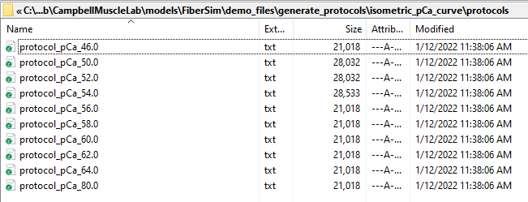

# Protocol

## Overview

The protocol file for a [job](../job/job.html) defines the experiment that is being simulated.

It is a tab-delimited text file with 4 columns and one row for each time-step in the simulation. Here is a very simple example.

````
dt	pCa	dhsl	mode
0.0001	9.0	0.0	-2.0
0.0001	9.0	0.0	-2.0
0.0001	4.5	0.0	-2.0
0.0001	4.5	0.0	-2.0
0.0001	4.5	1.0	-2.0
0.0001	4.5	0.0	-2.0
0.0001	4.5	0.0	1000.0
0.0001	4.5	0.0	1000.0
````

## Details

This section explains the components

| Key | Comment |
| ---- | ---- |
| dt | the duration of the time-step in seconds |
| pCa | the Ca<sup>2+</sup> concentration |
| dhsl | the length change in nm per half-sarcomere imposed during the time-step |
| mode | explained below |

## Mode

The `mode` value for each time-step controls the loading condition for the time-step.

+ -2 - the simulation is in length control mode
  + if `dhsl` is
    + 0, the simulation is isometric
    + \>0, the muscle is extended
    + \<0, the muscle is shortened

+ -1 - slack mode
  + this means check whether the muscle has fallen slack (that is, stress \< 0>)
    + if it is slack, shorten against zero load
    + if not, change length as defined by `dhsl`

+ \>=0 - isotonic mode
  + lengthen or shorten the muscle as required to keep stress equal to the mode value

## Example 1

````
dt	pCa	dhsl	mode
0.0001	9.0	0.0	-2.0
0.0001	9.0	0.0	-2.0
0.0001	4.5	0.0	-2.0
0.0001	4.5	0.0	-2.0
0.0001	4.5	1.0	-2.0
0.0001	4.5	0.0	-2.0
0.0001	4.5	0.0	1000.0
0.0001	4.5	0.0	1000.0
````

This example instruction file (copied from the top of the page) defines a simulation of 0.8 ms (there are 8 time-steps, each with a `dt` of 0.1 ms).

The first two data lines show that the muscle is held isometric (`mode` is -2.0, `dhsl` is 0).

The muscle is then activated in pCa 4.5 solution for the remainder of the simulation (`pCa` is 4.5 for time-steps 3 onwards).

The muscle is stretched by 1 nm per half-sarcomere on step 5 (`dhsl` is 1) and held at an isotonic load of 1000 N m<sup>-2</sup> for the time-steps 7 and 8 (`mode` is 1000).

## Example 2

This example shows how to generate a sequence of protocol files automatically.

+ Open an Anaconda Prompt

+ Activate the FiberSim Anaconda Environment by executing:
```
conda activate fibersim
```

+ Change directory to `<FiberSim_dir>/demo_files/generate_protocols/isometric_pCa_curve`, where `<FiberSim_dir>` is the directory where you installed FiberSim

+ Type `python generate_isometric_protocols.py`

+ This will write a sequence of protocols in the `protocols` sub-folder.



+ Each protocol file has 1000 time-steps, with the pCa switching from 9.0 to a defined value at the 11th time-step.

````
dt	pCa	dhsl	mode
0.0001	9.0	0.0	-2.0
0.0001	9.0	0.0	-2.0
0.0001	9.0	0.0	-2.0
0.0001	9.0	0.0	-2.0
0.0001	9.0	0.0	-2.0
0.0001	9.0	0.0	-2.0
0.0001	9.0	0.0	-2.0
0.0001	9.0	0.0	-2.0
0.0001	9.0	0.0	-2.0
0.0001	4.6	0.0	-2.0
0.0001	4.6	0.0	-2.0
0.0001	4.6	0.0	-2.0
0.0001	4.6	0.0	-2.0
0.0001	4.6	0.0	-2.0
0.0001	4.6	0.0	-2.0
0.0001	4.6	0.0	-2.0
0.0001	4.6	0.0	-2.0
0.0001	4.6	0.0	-2.0
0.0001	4.6	0.0	-2.0
<SNIP>
````

### Code

The `generate_isometric_protocos.py` code that created these files is as follows.

````
import os
import sys

import numpy as np

def write_protocols():
    """ Writes a sequence of protocols to a directory and generates a
        batch structure """
        
    # Variables
    protocol_path = 'protocols'
    
    isometric_pCa_values = np.concatenate(([8.0],
                                           np.arange(6.4, 5.0, -0.2),
                                           [4.6]))
    
    # Code
    
    # Add protocols to the path
    sys.path.append('../../../code/fiberpy/fiberpy/package/modules/protocols')
    import protocols
    
    # Create a batch
    FiberSim_batch = dict()
    FiberSim_batch['job'] = []
    
    # Loop through pCa values
    for pCa in isometric_pCa_values:
        
        # Generate the file_string
        prot_file_string = os.path.join(protocol_path,
                                        ('protocol_pCa_%.1f.txt' % (10*pCa)))
        
        # Generate the protocol
        prot = protocols.create_length_control_protocol(time_step = 0.0001,
                                                        n_points = 1000,
                                                        step_pCa = pCa)
        
        # Write protocol to file
        protocols.write_protocol_to_file(prot, prot_file_string)

if __name__ == "__main__":
    write_protocols()
````

This simple snippet can be modified for other purposes.


## More details

See the [demos](../../demos/demos.html)
