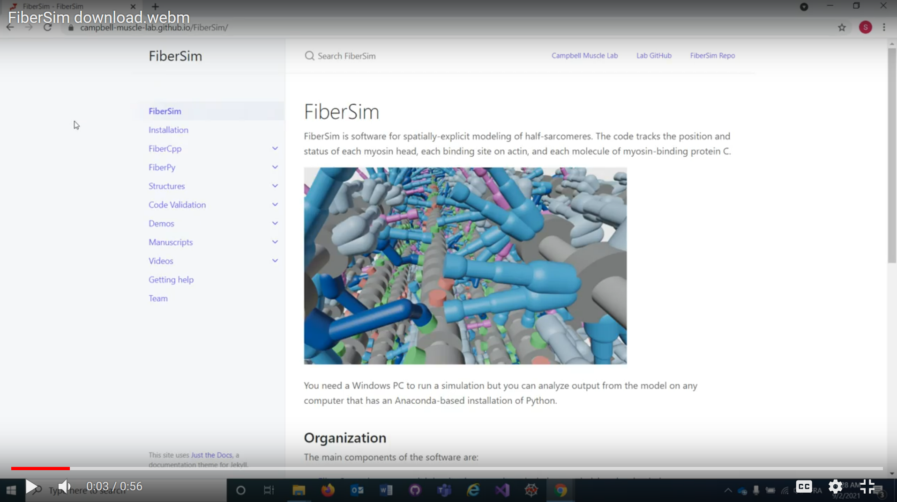
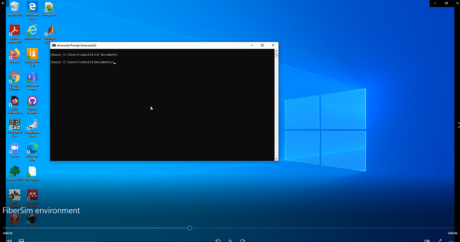
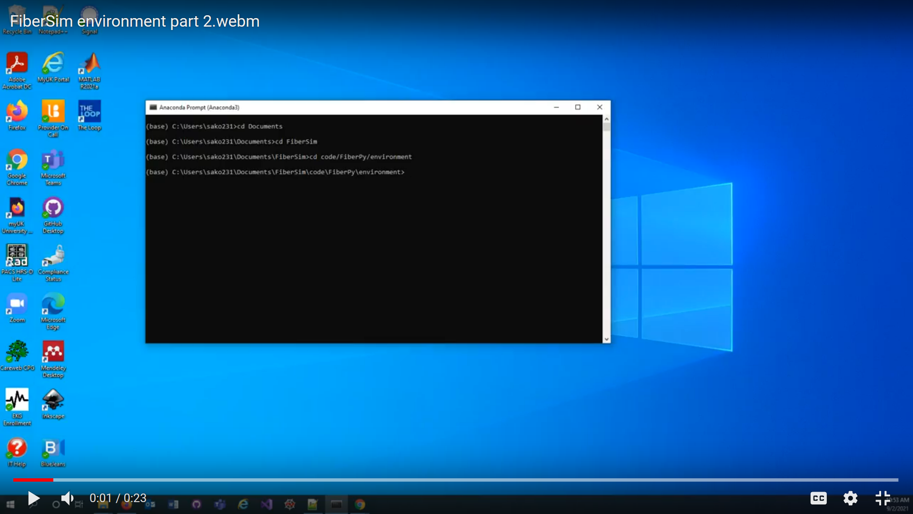

# HowTos

Here is a list of tutorial videos to help you getting started with FiberSim.

1) Downloading FiberSim

2) Activating the FiberSim environment (make sure you have [installed Anaconda](https://www.anaconda.com/products/individual#windows) first - Python 3.8 version)

Part 1:

Part 2:

You are now ready to try the first [demos](../../demos/getting_started/getting_started.html).

